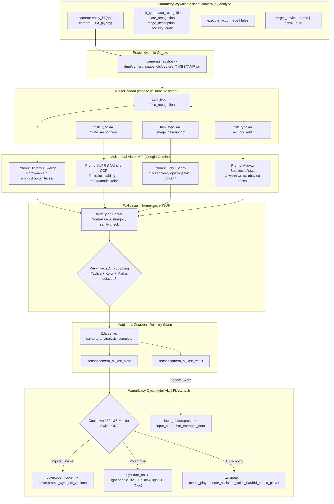
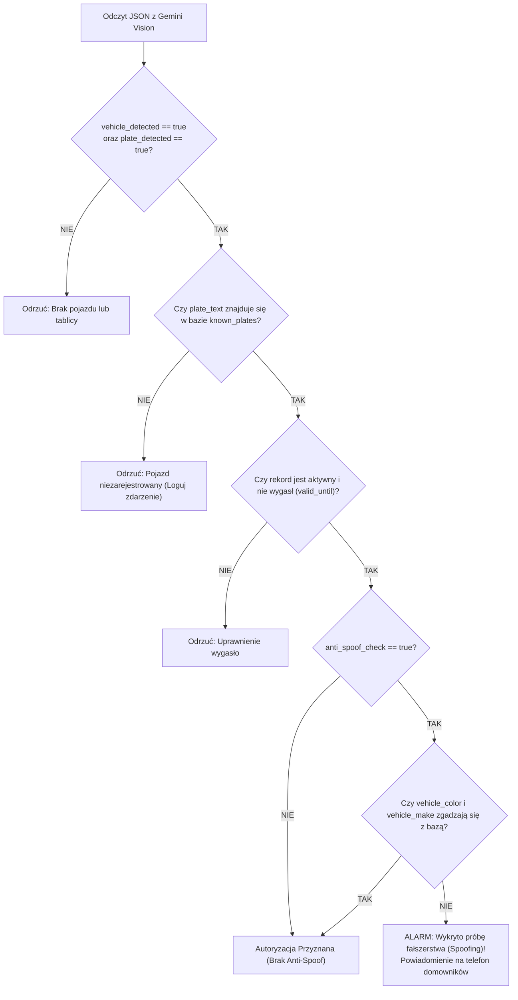

# Propozycja Architektoniczna: Uniwersalny Silnik Camera AI — Biometryczne Rozpoznawanie Twarzy (Face) oraz Automatyczne Rozpoznawanie Tablic Rejestracyjnych (ALPR / ANPR)

> **Status dokumentu:** Zaprojektowane / Do wdrożenia w etapach (Future Feature Roadmap)  
> **Lokalizacja projektu:** `/Users/wtrzonkowski/Desktop/private/homeassistant`  
> **Technologia AI:** Cloud Vision Multimodal AI (Google Generative AI / Gemini API)  
> **Sprzęt testowy Phase 1 (Face):** `camera.taras_plynny` (kamera tarasowa)  
> **Sprzęt testowy Phase 2 (ALPR):** `camera.520a_plynny` (kamera front/brama) oraz `camera.reolink_duo_floodlight_poe_plynny_2` (kamera podwórze/podjazd)  
> **Urządzenia wykonawcze:** Rygiel drzwi wejściowych (`input_button.btn_entrance_door`), Brama wjazdowa (`cover.brama_wynajem_zaslona`), Oświetlenie podjazdu (`light.boneio_32_l_07_new_light_12`), Głośnik Voice PE (`media_player.home_assistant_voice_0a9bfd_media_player`)  
> **Cel główny:** Stworzenie zunifikowanego, generycznego silnika analizy wizyjnej w Home Assistant obsługującego rozpoznawanie twarzy domowników (kontrola rygla drzwi), automatyczne rozpoznawanie tablic rejestracyjnych pojazdów (otwieranie bramy i doświetlenie podjazdu), ogólny opis sceny oraz audyty bezpieczeństwa perymetrii.

---

## Spis Treści
1. [Podsumowanie Wykonawcze i Założenia Projektowe](#1-podsumowanie-wykonawcze-i-założenia-projektowe)
2. [Generyczna Architektura Silnika (`script.camera_ai_analyze`)](#2-generyczna-architektura-silnika-scriptcamera_ai_analyze)
3. [Podsystem A: Biometryczne Rozpoznawanie Twarzy (Face Recognition)](#3-podsystem-a-biometryczne-rozpoznawanie-twarzy-face-recognition)
4. [Podsystem B: Automatyczne Rozpoznawanie Tablic Rejestracyjnych (ALPR / ANPR)](#4-podsystem-b-automatyczne-rozpoznawanie-tablic-rejestracyjnych-alpr--anpr)
   - 4.1. [Analiza Wykonalności Technicznej (Multimodal Vision LLM vs Tradycyjny ALPR)](#41-analiza-wykonalności-technicznej-multimodal-vision-llm-vs-tradycyjny-alpr)
   - 4.2. [Elastyczność Kamer i Topologia Sprzętowa](#42-elastyczność-kamer-i-topologia-sprzętowa)
   - 4.3. [Baza Znanych Pojazdów i Uprawnień (`/config/known_plates.yaml`)](#43-baza-znanych-pojazdów-i-uprawnień-configknown_platesyaml)
   - 4.4. [Prompt Inżynieryjny i Kontrakt Danych JSON](#44-prompt-inżynieryjny-i-kontrakt-danych-json)
   - 4.5. [Weryfikacja Dwuskładnikowa i Ochrona Przed Spoofingiem (Anti-Spoofing)](#45-weryfikacja-dwuskładnikowa-i-ochrona-przed-spoofingiem-anti-spoofing)
   - 4.6. [Zabezpieczenia Fizyczne Silnika i Niezależność Wykonawcza](#46-zabezpieczenia-fizyczne-silnika-i-niezależność-wykonawcza)
5. [Katalog Propozycji Zastosowań (Use-Case Proposals dla Użytkownika)](#5-katalog-propozycji-zastosowań-use-case-proposals-dla-użytkownika)
   - 5.1. [Kategoria A: Kontrola Dostępów i Bramy (Access & Gate Proposals)](#51-kategoria-a-kontrola-dostępów-i-bramy-access--gate-proposals)
   - 5.2. [Kategoria B: Komfort, Oświetlenie i Audio (Convenience & Ambient Proposals)](#52-kategoria-b-komfort-oświetlenie-i-audio-convenience--ambient-proposals)
   - 5.3. [Kategoria C: Bezpieczeństwo, Kurierzy i Ochrona Przed Oszustwem (Security & Deliveries Proposals)](#53-kategoria-c-bezpieczeństwo-kurierzy-i-ochrona-przed-oszustwem-security--deliveries-proposals)
   - 5.4. [Kategoria D: Energia i Samochody Elektryczne (Energy & EV Charging Proposals)](#54-kategoria-d-energia-i-samochody-elektryczne-energy--ev-charging-proposals)
6. [Magistrala Zdarzeń i Telemetria Encji HA](#6-magistrala-zdarzeń-i-telemetria-encji-ha)
7. [Etapowa Roadmapa Wdrożenia (Etapy 1 – 5)](#7-etapowa-roadmapa-wdrożenia-etapy-1--5)
8. [Kompletny Kod Konfiguracji YAML (w tym Szablony Automatyzacji dla Wybranych Propozycji)](#8-kompletny-kod-konfiguracji-yaml)
   - 8.1. [Baza Pojazdów (`config/known_plates.yaml`)](#81-baza-pojazdów-configknown_platesyaml)
   - 8.2. [Pomocniki i Sensory Template (`config/configuration.yaml` & `config/templates.yaml`)](#82-pomocniki-i-sensory-template-configconfigurationyaml--configtemplatesyaml)
   - 8.3. [Centralny Skrypt Analizy AI (`config/scripts.yaml`)](#83-centralny-skrypt-analizy-ai-configscriptsyaml)
   - 8.4. [Szablony Automatyzacji dla Wybranych Propozycji (`config/automations.yaml`)](#84-szablony-automatyzacji-dla-wybranych-propozycji-configautomationsyaml)
   - 8.5. [Karty Dashboardu Lovelace (`dashboard_modern_reference.yaml`)](#85-karty-dashboardu-lovelace-dashboard_modern_referenceyaml)
9. [Kwestie Bezpieczeństwa, Prywatności i Niezawodności](#9-kwestie-bezpieczeństwa-prywatności-i-niezawodności)

---

## 1. Podsumowanie Wykonawcze i Założenia Projektowe

Projekt instalacji inteligentnego domu opartej o Home Assistant, kamery Reolink POE oraz sterowniki BoneIO DIN wymaga zaawansowanej, lecz lekkiej i bezawaryjnej analizy wizyjnej. Rozszerzenie dotychczasowego projektu rozpoznawania twarzy o **Automatic License Plate Recognition (ALPR / ANPR)** wprowadza automatyzację wjazdu pojazdów domowników i gości.

### Kluczowe Założenia Architektoniczne:
1. **Uniwersalny Silnik Wizyjny (`Single-Engine Architecture`):**  
   Zamiast wdrażać oddzielne, odizolowane komponenty dla twarzy, tablic rejestracyjnych i opisów scen, cała analiza wizyjna jest realizowana przez jeden centralny skrypt `script.camera_ai_analyze`. Typ zadania definiowany jest parametrem `task_type` (`face_recognition`, `plate_recognition`, `image_description`, `security_audit`).
2. **Kamera-Agnostyczność (Camera Flexibility):**  
   Skrypt nie posiada zakodowanej na stałe kamery. Może współpracować z dowolną encją kamery w systemie:
   - `camera.520a_plynny` (kamera frontowa przy bramie wjazdowej),
   - `camera.reolink_duo_floodlight_poe_plynny_2` (kamera szerokokątna na podwórze/podjazd),
   - `camera.taras_plynny` (kamera patio/taras dla testów biometrycznych twarzy),
   - `camera.rlc_822a_plynny` (kamera 4K wejścia),
   - Dedykowana przyszła kamera LPR z teleobiektywem.
3. **Multimodalne Vision AI (Google Gemini API):**  
   Przetwarzanie obrazu realizowane jest bezstanowo w chmurze za pośrednictwem oficjalnej integracji Google Generative AI w Home Assistant. Eliminuje to potrzebę instalowania ciężkich kontenerów wektorowych/sieci neuronowych (np. DeepStack, Double Take, CompreFace, Plate Recognizer) obciążających procesor serwera Docker.
4. **Dwuskładnikowa Weryfikacja Pojazdu (Anti-Spoofing):**  
   System nie tylko odczytuje numer tablicy rejestracyjnej, lecz jednocześnie weryfikuje wizualne atrybuty pojazdu: **markę, model, typ nadwozia oraz kolor**. Zapobiega to próbom sforsowania bramy za pomocą wydrukowanej na papierze tablicy rejestracyjnej domownika podstawionej przed obcy pojazd.
5. **Pełna Separacja Silnika Analitycznego od Scenariuszy Użycia (Decoupled Engine & Use-Case Proposals):**  
   Silnik `script.camera_ai_analyze` odpowiada **wyłącznie za akwizycję obrazu z kamery, multimodalną inferencję Gemini, weryfikację anty-spoofingową i publikację czystych danych na magistralę zdarzeń (`camera_ai_analysis_complete`) oraz sensory stanu (`sensor.camera_ai_last_plate`, `sensor.camera_ai_last_result`)**. W samym silniku nie ma zakodowanych na stałe żadnych sztywnych akcji fizycznych. Wszystkie konkretne zastosowania wykonawcze (otwieranie bramy, doświetlenie, audio TTS, przypomnienia) stanowią **modularny katalog propozycji (Use-Case Proposals)** — to użytkownik decyduje, które z nich, kiedy i w jaki sposób wdrożyć w automatyzacjach.

---

## 2. Generyczna Architektura Silnika (`script.camera_ai_analyze`)

Poniższy diagram przedstawia przepływ danych w centralnym silniku wizyjnym dla wszystkich typów zadań:



---

## 3. Podsystem A: Biometryczne Rozpoznawanie Twarzy (Face Recognition)

### 3.1. Przechowywanie Portretów Referencyjnych
W katalogu `/config/known_faces/` (udostępnionym w `allowlist_external_dirs`) umieszczone są wzorcowe zdjęcia domowników:
- `wiktor.jpg` – portret Wiktora (jasne, ostre ujęcie twarzy na wprost),
- `klara.jpg` – portret Klary,
- `nikola.jpg` – portret Nikoli.

### 3.2. Kontrakt JSON dla Twarzy
```json
{
  "person_detected": true,
  "recognized_name": "Wiktor",
  "is_authorized": true,
  "confidence": 88,
  "description": "Mężczyzna w ciemnej kurtce, zbliża się do drzwi wejściowych."
}
```

### 3.3. Akcja Wykonawcza
Przy spełnieniu kryteriów `is_authorized: true` oraz `confidence >= 70%` silnik wyzwala otwarcie rygla drzwi wejściowych poprzez wciśnięcie `input_button.btn_entrance_door`. Rygiel posiada sprzętowe zabezpieczenie wyłączenia po maksymalnie 2 minutach (`lock.rygiel_drzwi_wejsciowych_lock`).

---

## 4. Podsystem B: Automatyczne Rozpoznawanie Tablic Rejestracyjnych (ALPR / ANPR)

### 4.1. Analiza Wykonalności Technicznej (Multimodal Vision LLM vs Tradycyjny ALPR)

| Kryterium | Tradycyjny Lokalny ALPR (np. FastALPR / OpenALPR) | Multimodal Vision LLM (Google Gemini Vision API) |
|---|---|---|
| **Wymagania Sprzętowe** | Wymaga dedykowanego kontenera, silnika ONNX/TensorRT, dużego zużycia CPU/GPU na maszynie Docker. | **Zero narzutu sprzętowego.** Pojedyncze zapytanie HTTPS API do chmury. |
| **Odporność na Kąt i Brud** | Bardzo niska. Wymaga dedykowanej kamery skierowanej idealnie wprost na tablicę pod kątem < 15°. | **Bardzo wysoka.** Model rozumie perspektywę, zniekształcenia kątowe, cienie i zabrudzenia. |
| **Kontekst Sceny i Pojazdu** | Wyłącznie odczyt znaków OCR (brak wiedzy o pojeździe). | **Kompletny audyt wizualny:** jednocześnie rozpoznaje markę, model, kolor pojazdu, typ nadwozia oraz kierunek jazdy. |
| **Odporność na Ataki (Anti-Spoofing)** | Zerowa – wydrukowana tablica na tekturze otwiera bramę. | **Dwuskładnikowa weryfikacja:** weryfikacja zgodności koloru i sylwetki pojazdu z bazą. |
| **Czas Odpowiedzi (Latency)** | 200 ms – 500 ms | 900 ms – 1600 ms (w pełni wystarczające dla pojazdu dojeżdżającego do bramy z prędkością 5–15 km/h). |
| **Koszty Operacyjne** | Darmowy lokalny, lecz wymaga stałego utrzymania oprogramowania. | Znikome (darmowy tier Gemini API lub ułamki centa za wywołanie przy ~15 wjazdach dziennie). |

**Wniosek:** Wykorzystanie multimodalnego modelu Gemini Vision w ramach generycznego skryptu jest rozwiązaniem optymalnym pod kątem niezawodności, zerowego zużycia zasobów lokalnego serwera oraz zaawansowanych możliwości bezpieczeństwa (anty-spoofing).

---

### 4.2. Elastyczność Kamer i Topologia Sprzętowa

Silnik może pobierać klatki z dowolnej kamery zewnętrznej:
1. **`camera.520a_plynny` (Kamera Front / Brama):**  
   - Model: Reolink RLC-520A POE.
   - Położenie: Skierowana bezpośrednio na bramę wjazdową i podjazd od strony ulicy.
   - Zastosowanie: Główna kamera detekcji pojazdów wjeżdżających na posesję.
2. **`camera.reolink_duo_floodlight_poe_plynny_2` (Kamera Podwórze / Podjazd):**  
   - Model: Reolink Duo Floodlight POE (podwójny obiektyw, kąt 180°).
   - Położenie: Szeroki widok całego wewnętrznego podjazdu i strefy garażowej.
   - Zastosowanie: Dodatkowa weryfikacja pojazdu po minięciu bramy oraz automatyka wyjazdu.
3. **Przyszła Dedykowana Kamera LPR (`camera.brama_lpr`):**  
   - W przypadku montażu kamery wąskokątnej z filtrem polaryzacyjnym i oświetlaczem IR przy samej krawędzi bramy, wystarczy zmienić parametr `camera` w automatyzacji wyzwalającej.

---

### 4.3. Baza Znanych Pojazdów i Uprawnień (`/config/known_plates.yaml`)

Plik `/config/known_plates.yaml` stanowi centralną bazę uprawnionych pojazdów domowników oraz gości:

```yaml
# Baza znanych tablic rejestracyjnych i pojazdów
known_plates:
  - plate: "WI12345"
    display_plate: "WI 12345"
    owner: "Wiktor"
    vehicle_make: "Tesla"
    vehicle_model: "Model Y"
    vehicle_color: "White"
    vehicle_type: "suv"
    authorized_gates:
      - cover.brama_wynajem_zaslona
    anti_spoof_check: true
    notify_voice: true
    voice_announcement: "Wjeżdża Tesla Wiktora"
    active: true

  - plate: "WPI9876A"
    display_plate: "WPI 9876A"
    owner: "Klara"
    vehicle_make: "Toyota"
    vehicle_model: "Yaris"
    vehicle_color: "Silver"
    vehicle_type: "hatchback"
    authorized_gates:
      - cover.brama_wynajem_zaslona
    anti_spoof_check: true
    notify_voice: true
    voice_announcement: "Wjeżdża Toyota Klary"
    active: true

  - plate: "WZ33221"
    display_plate: "WZ 33221"
    owner: "Gość Apartament 1"
    vehicle_make: "Skoda"
    vehicle_model: "Octavia"
    vehicle_color: "Blue"
    vehicle_type: "wagon"
    authorized_gates:
      - cover.brama_wynajem_zaslona
    anti_spoof_check: false
    notify_voice: true
    voice_announcement: "Wjeżdża gość do apartamentu pierwszego"
    valid_until: "2026-10-05T12:00:00"
    active: true
```

#### Kluczowe Pola Rekordu Pojazdu:
- `plate`: Znormalizowany numer tablicy rejestracyjnej (bez spacji, myślników, wyłącznie wielkie litery alfabetu łacińskiego i cyfry).
- `vehicle_make`, `vehicle_model`, `vehicle_color`: Atrybuty wizualne wykorzystywane do dwuskładnikowej weryfikacji anti-spoofing.
- `authorized_gates`: Lista encji bram/zapór, które pojazd ma prawo otwierać.
- `anti_spoof_check`: Flaga nakazująca obowiązkowe porównanie koloru i marki z obrazu kamery z rekordem w bazie.
- `valid_until`: Opcjonalny stempel czasowy wygaśnięcia dostępu (dla gości apartamentów `local01`–`local06` lub ekip remontowych).
- `notify_voice`: Czy wygenerować powiadomienie TTS na głośniku Home Assistant Voice PE.

---

### 4.4. Prompt Inżynieryjny i Kontrakt Danych JSON

#### Prompt Systemowy dla Gemini Vision:
```text
You are an advanced Automated Number Plate Recognition (ANPR / ALPR) and Vehicle Verification System for a high-security residential property.
Analyze the provided camera snapshot carefully:
1. Detect any motor vehicles (cars, SUVs, vans, trucks, motorcycles).
2. Locate the license plate and extract all alphanumeric characters. Standard Polish plates have format like 'WI 12345' or 'WPI 9876A'. Return normalized plate text in uppercase without spaces, hyphens, or dots.
3. Identify visual vehicle attributes:
   - Make (e.g., Tesla, Toyota, BMW, Audi, Volkswagen, Mercedes, etc.)
   - Model (e.g., Model Y, Yaris, Golf, etc. or 'unknown' if uncertain)
   - Primary vehicle color (e.g., white, black, silver, gray, blue, red, green)
   - Body type (sedan, suv, hatchback, wagon, van, pickup, motorcycle)
4. Determine if the vehicle is approaching the entrance gate (facing front) or departing.
5. Assess plate optical clarity: 'clear', 'blurry', 'angled', 'obscured', 'glare'.
6. Provide an integer confidence score (0-100) for the plate reading accuracy.

Return STRICT VALID JSON ONLY (no markdown blocks, no commentary, no backticks):
{
  "vehicle_detected": true,
  "plate_detected": true,
  "plate_text": "WI12345",
  "vehicle_make": "Tesla",
  "vehicle_model": "Model Y",
  "vehicle_color": "white",
  "vehicle_type": "suv",
  "confidence": 94,
  "plate_quality": "clear",
  "is_approaching": true,
  "description": "Biała Tesla Model Y zbliża się do bramy wjazdowej, przednia tablica rejestracyjna wyraźna."
}

If no vehicle is present:
{
  "vehicle_detected": false,
  "plate_detected": false,
  "plate_text": "",
  "vehicle_make": "none",
  "vehicle_model": "none",
  "vehicle_color": "none",
  "vehicle_type": "none",
  "confidence": 0,
  "plate_quality": "none",
  "is_approaching": false,
  "description": "Brak pojazdów w polu widzenia kamery."
}
```

---

### 4.5. Weryfikacja Dwuskładnikowa i Ochrona Przed Spoofingiem (Anti-Spoofing)

Tradycyjne systemy ALPR są podatne na proste wektory ataków, np. podsunięcie przed kamerę wydrukowanej kartki A4 z numerem tablicy domownika lub zamontowanie skradzionej tablicy na innym samochodzie.

W prezentowanej architekturze zastosowano **dwuskładnikową weryfikację wizualną**:
1. **Warunek 1: Dopasowanie Tablicy (OCR Match):**  
   Znormalizowany odczyt `plate_text` musi dokładnie odpowiadać rekordowi w bazie (lub posiadać dystans Levenshteina $\le 1$ w przypadku pomyłki znaków `0`/`O` lub `8`/`B` przy `confidence >= 85%`).
2. **Warunek 2: Detekcja Prawdziwego Pojazdu (3D Physical Vehicle):**  
   Parametry `vehicle_detected: true` oraz `vehicle_type != 'none'`. Wyklucza to osoby piesze trzymające kartkę z tablicą w ręku.
3. **Warunek 3: Wizualna Zgodność Sylwetki i Koloru (Semantic Match):**  
   Dla pojazdów z aktywną flagą `anti_spoof_check: true`, odczytany z obrazu `vehicle_color` (np. `white`) oraz `vehicle_make` (np. `Tesla`) muszą być semantycznie zgodne z rekordem w bazie. Jeżeli tablica "WI12345" (zarejestrowana jako biała Tesla) pojawi się na czerwonym vanie, autoryzacja zostaje natychmiast odrzucona z flagą `spoof_detected`, generując krytyczne powiadomienie bezpieczeństwa.
4. **Warunek 4: Ważność Czasowa (Access Expiration):**  
   Jeśli rekord posiada pole `valid_until`, bieżący czas musi być wcześniejszy od zdefiniowanej daty wygaśnięcia.



---

### 4.6. Zabezpieczenia Fizyczne Silnika i Niezależność Wykonawcza

Wszelkie fizyczne działania w świecie rzeczywistym (np. ruch bramy, impuls rygla) podlegają ścisłym zabezpieczeniom logicznym na poziomie Home Assistant:

1. **Blokada Wielokrotnego Wyzwalania (Debounce Cooldown – 180 sekund):**  
   Gdy pojazd oczekuje przed bramą lub powoli przez nią przejeżdża, kamery mogą wygenerować kilka klatek w krótkim odstępie czasu. Pomocnik `input_datetime.camera_ai_last_gate_trigger` przechowuje znacznik czasu ostatniego otwarcia. Kolejne otwarcie jest blokowane, jeśli od poprzedniego minęło mniej niż 180 sekund.
2. **Główny Przełącznik Bezpieczeństwa (Master Switch):**  
   Encja `input_boolean.camera_ai_gate_auto_open` pozwala domownikom na natychmiastowe wyłączenie automatycznego otwierania bramy (np. podczas wyjazdu na urlop lub podwyższonego stanu alarmowego).
3. **Niezależność Wykonawcza:**  
   Silnik `script.camera_ai_analyze` kończy swoje działanie na publikacji danych i zdarzenia `camera_ai_analysis_complete`. Żadne konkretne akcje (otwarcie bramy, impuls rygla, światło) nie są w nim zaszyte na stałe. Poniższy katalog propozycji przedstawia scenariusze, które użytkownik może dowolnie wdrożyć według własnych preferencji.

---

## 5. Katalog Propozycji Zastosowań (Use-Case Proposals dla Użytkownika)

Wszystkie scenariusze wykonawcze stanowią **modularne propozycje dla użytkownika**. Użytkownik decyduje, które automatyzacje aktywować i jak je spersonalizować:

### 5.1. Kategoria A: Kontrola Dostępów i Bramy (Access & Gate Proposals)
- **Propozycja A1: Automatyczne Otwieranie Bramy Wjazdowej (`cover.brama_wynajem_zaslona`):**  
  Automatyczne podniesienie/odsunięcie bramy, gdy kamera `camera.520a_plynny` wykryje zbliżający się pojazd domownika (`is_authorized: true`, `is_approaching: true`), z aktywnym filtrem debounce 180s i weryfikacją przełącznika bezpieczeństwa.
- **Propozycja A2: Elastyczny Dostęp dla Gości i Najemców (`local01`–`local06`):**  
  Tymczasowe uprawnienie wjazdu dla gości apartamentów na wynajem. Wpis w bazie `known_plates.yaml` zawiera pole `valid_until` (np. data i godzina wymeldowania). Po tym czasie system odrzuca autoryzację wjazdu.
- **Propozycja A3: Biometryczne Otwieranie Rygla Drzwi (`input_button.btn_entrance_door`):**  
  Automatyczne zwolnienie rygla drzwi wejściowych (z wbudowanym 2-minutowym wyłączeniem bezpieczeństwa) po rozpoznaniu twarzy domownika na kamerze tarasowej lub dedykowanej kamerze wejściowej (`confidence >= 70%`).

### 5.2. Kategoria B: Komfort, Oświetlenie i Audio (Convenience & Ambient Proposals)
- **Propozycja B1: Inteligentne Doświetlenie Podjazdu w Nocy:**  
  Jeśli uprawniony pojazd wjeżdża po zmroku (pomiędzy `input_datetime.pora_zmroku` a `input_datetime.pora_switu`), przekaźnik BoneIO `light.boneio_32_l_07_new_light_12` włącza latarnię podjazdu na 5 minut, ułatwiając manewrowanie i dojście do domu.
- **Propozycja B2: Personalizowane Zapowiedzi Głosowe Voice PE:**  
  Głośnik satelita w wiatrołapie (`media_player.home_assistant_voice_0a9bfd_media_player`) przez Nabu Casa Cloud TTS wita domowników lub informuje o wjeździe (np. *"Wjeżdża Tesla Wiktora"* lub *"Wjeżdża gość do apartamentu drugiego"*).
- **Propozycja B3: Podgląd Obrazu na Telewizorze Salon TCL Google TV:**  
  W momencie wykrycia zbliżającego się pojazdu na bramie, jeśli telewizor w salonie jest włączony (`media_player.salon_2`), system może wyświetlić powiadomienie ekranowe lub przełączyć podgląd strumienia HLS z kamery bramy (`camera.520a_plynny`).

### 5.3. Kategoria C: Bezpieczeństwo, Kurierzy i Ochrona Przed Oszustwem (Security & Deliveries Proposals)
- **Propozycja C1: Detekcja Kurierów i Dostawców Paczek:**  
  Model Gemini Multimodal rozpoznaje malowanie samochodów kurierskich (InPost, DPD, DHL, GLS, Poczta Polska, Amazon, FedEx) na podstawie `vehicle_make` i cech wizualnych, wysyłając natychmiastowe powiadomienie push: *"Kurier InPost pod bramą"* wraz ze snapshotem i przyciskiem szybkiego otwarcia furtki.
- **Propozycja C2: Ostrzeżenie o Nieznanym Samochodzie w Nocy:**  
  Gdy nieznany samochód zatrzyma się przed posesją między 23:00 a 06:00, system wysyła ciche powiadomienie na telefony domowników ze zdjęciem pojazdu, nie otwierając bramy.
- **Propozycja C3: Alarm Anty-Spoofingowy (Próba Fałszerstwa Tablicy):**  
  Wykrycie znanej tablicy rejestracyjnej na pojeździe o niezgodnej marce lub kolorze (np. tablica Tesli na dostawczym vanie) generuje natychmiastowy alarm i powiadomienie o potencjalnej próbie oszustwa.

### 5.4. Kategoria D: Energia i Samochody Elektryczne (Energy & EV Charging Proposals)
- **Propozycja D1: Synchronizacja Ładowania EV z Najtańszą Energią Pstryk:**  
  Wykrycie powrotu samochodu elektrycznego (Tesla) na posesję może sprawdzić aktualny poziom baterii oraz stan czujnika `binary_sensor.pstryk_in_best_window_dol`. Jeśli zbliża się najtańsze okno cenowe, głośnik Voice PE przypomina o podłączeniu kabla ładowania.

---

## 6. Magistrala Zdarzeń i Telemetria Encji HA

Wszystkie rezultaty analizy wizyjnej trafiają na magistralę zdarzeń Home Assistant, zapewniając pełną przejrzystość oraz możliwość integracji z dowolnymi przyszłymi automatyzacjami:

### 6.1. Zdarzenie: `camera_ai_analysis_complete`
Publikowane ze szczegółowym obiektem danych:
```yaml
event_type: camera_ai_analysis_complete
data:
  task_type: plate_recognition # lub face_recognition, image_description
  camera: camera.520a_plynny
  vehicle_detected: true
  plate_detected: true
  plate_text: "WI12345"
  vehicle_make: "Tesla"
  vehicle_model: "Model Y"
  vehicle_color: "white"
  vehicle_type: "suv"
  confidence: 94
  is_authorized: true
  owner: "Wiktor"
  description: "Biała Tesla Model Y zbliża się do bramy wjazdowej, przednia tablica rejestracyjna wyraźna."
  spoof_status: "verified"
  gate_opened: true
  timestamp: "2026-09-23T22:30:00+02:00"
```

### 6.2. Encje Stanu w Home Assistant
1. `sensor.camera_ai_last_plate`:
   - Stan (`state`): Numer ostatnio odczytanej tablicy rejestracyjnej (np. `WI12345` lub `unknown`).
   - Atrybuty: Właściciel, marka, model, kolor, pewność (%), autoryzacja (true/false), flaga otwarcia bramy, nazwa kamery, stempel czasu.
2. `sensor.camera_ai_last_result`:
   - Stan (`state`): Główny wynik analizy (nazwa rozpoznanej osoby, numer tablicy lub status opisu).
   - Atrybuty: Szczegółowy opis tekstowy, typ zadania, poziom ufności (%).
3. `input_datetime.camera_ai_last_gate_trigger`:
   - Przechowuje dokładną datę i godzinę ostatniego wyzwolenia bramy przez AI (do weryfikacji debounce).
4. `input_boolean.camera_ai_gate_auto_open`:
   - Przełącznik ON/OFF pozwalający włączać i wyłączać automatyczne otwieranie bramy.

---

## 7. Etapowa Roadmapa Wdrożenia (Etapy 1 – 5)

Architektura została podzielona na logiczne fazy wdrażania gwarantujące bezpieczeństwo instalacji:

| Etap | Nazwa Etapu | Zakres Działań i Realizacja |
|---|---|---|
| **Etap 1** | **Test Biometrii Twarzy (Taras)** | Ręczne testy z poziomu dashboardu Multimedia przy użyciu `camera.taras_plynny`. Weryfikacja dokładności rozpoznawania twarzy Wiktora, Klary i Nikoli oraz symulacja sterowania ryglem drzwi. |
| **Etap 2** | **Test ALPR i Weryfikacji Pojazdów (Brama/Wjazd)** | Dodanie gałęzi `plate_recognition` do skryptu `script.camera_ai_analyze`. Utworzenie `/config/known_plates.yaml`. Ręczne testowanie snapshotów z `camera.520a_plynny` oraz `camera.reolink_duo_floodlight_poe_plynny_2` przyciskami na dashboardzie. |
| **Etap 3** | **Zdarzeniowe Wyzwalanie z Czujników Reolink AI** | Podpięcie czujnika detekcji pojazdów Reolink (`binary_sensor.520a_vehicle`) jako wyzwalacza analizy ALPR. Wdrożenie 3-minutowego debounce cooldown i bezpiecznego otwierania `cover.brama_wynajem_zaslona`. |
| **Etap 4** | **Integracja Audio Voice PE i Powiadomienia Nocne** | Dodanie komunikatów głosowych Nabu Casa TTS na głośniku `media_player.home_assistant_voice_0a9bfd_media_player` po wjeździe domowników. Wysyłanie powiadomień push ze zdjęciem przy wykryciu nieznanego pojazdu w nocy. |
| **Etap 5** | **Dedykowana Kamera LPR & Podczerwień** | Opcjonalna instalacja dedykowanej kamery tablicowej z teleobiektywem przy krawędzi wjazdu. Przełączenie parametru kamery w automatyzacji bez jakichkolwiek modyfikacji kodu silnika. |

---

## 8. Kompletny Kod Konfiguracji YAML (w tym Szablony Automatyzacji dla Wybranych Propozycji)

### 8.1. Baza Pojazdów (`config/known_plates.yaml`)
Plik tworzony w głównym katalogu konfiguracyjnym:
```yaml
# /config/known_plates.yaml
known_plates:
  - plate: "WI12345"
    display_plate: "WI 12345"
    owner: "Wiktor"
    vehicle_make: "Tesla"
    vehicle_model: "Model Y"
    vehicle_color: "white"
    vehicle_type: "suv"
    authorized_gates:
      - cover.brama_wynajem_zaslona
    anti_spoof_check: true
    notify_voice: true
    voice_announcement: "Wjeżdża Tesla Wiktora"
    active: true

  - plate: "WPI9876A"
    display_plate: "WPI 9876A"
    owner: "Klara"
    vehicle_make: "Toyota"
    vehicle_model: "Yaris"
    vehicle_color: "silver"
    vehicle_type: "hatchback"
    authorized_gates:
      - cover.brama_wynajem_zaslona
    anti_spoof_check: true
    notify_voice: true
    voice_announcement: "Wjeżdża Toyota Klary"
    active: true
```

---

### 7.2. Pomocniki i Sensory Template (`config/configuration.yaml` & `config/templates.yaml`)

W `config/configuration.yaml`:
```yaml
homeassistant:
  allowlist_external_dirs:
    - /tmp
    - /tmp/camera_snapshots
    - /config/known_faces
    - /config

input_boolean:
  camera_ai_gate_auto_open:
    name: "Camera AI: Automatyczne Otwieranie Bramy"
    icon: mdi:gate-arrow-right
    initial: true

input_datetime:
  camera_ai_last_gate_trigger:
    name: "Camera AI: Czas Ostatniego Otwarcia Bramy"
    has_date: true
    has_time: true
```

W `config/templates.yaml`:
```yaml
- trigger:
    - trigger: event
      event_type: camera_ai_analysis_complete
  sensor:
    # --- SENSOR OGÓLNY SILNIKA WIZYJNEGO ---
    - name: "Camera AI Last Result"
      unique_id: camera_ai_last_result
      state: >-
        
          {{ trigger.event.data.plate_text | default('unknown') }}
        
          {{ trigger.event.data.recognized_name | default('unknown') }}
        
      icon: >-
        
          mdi:car-info
        
          mdi:face-recognition
        
      attributes:
        task_type: "{{ trigger.event.data.task_type | default('') }}"
        camera: "{{ trigger.event.data.camera | default('') }}"
        confidence: "{{ trigger.event.data.confidence | default(0) }}"
        is_authorized: "{{ trigger.event.data.is_authorized | default(false) }}"
        description: "{{ trigger.event.data.description | default('') }}"
        timestamp: "{{ now().isoformat() }}"

    # --- DEDYKOWANY SENSOR TABLIC REJESTRACYJNYCH (ALPR) ---
    - name: "Camera AI Last Plate"
      unique_id: camera_ai_last_plate
      state: >-
        
          {{ trigger.event.data.plate_text | default('none') }}
        
          {{ states('sensor.camera_ai_last_plate') }}
        
      icon: mdi:card-account-details-outline
      attributes:
        owner: "{{ trigger.event.data.owner | default('Nieznany') }}"
        vehicle_make: "{{ trigger.event.data.vehicle_make | default('N/A') }}"
        vehicle_model: "{{ trigger.event.data.vehicle_model | default('N/A') }}"
        vehicle_color: "{{ trigger.event.data.vehicle_color | default('N/A') }}"
        vehicle_type: "{{ trigger.event.data.vehicle_type | default('N/A') }}"
        confidence: "{{ trigger.event.data.confidence | default(0) }}"
        is_authorized: "{{ trigger.event.data.is_authorized | default(false) }}"
        gate_opened: "{{ trigger.event.data.gate_opened | default(false) }}"
        camera: "{{ trigger.event.data.camera | default('') }}"
        timestamp: "{{ now().isoformat() }}"
```

---

### 7.3. Centralny Skrypt Analizy AI (`config/scripts.yaml`)

```yaml
camera_ai_analyze:
  alias: "Camera AI: Uniwersalny Silnik Analizy Wizyjnej"
  description: "Zunifikowany skrypt multimodalnej analizy obrazu: rozpoznawanie twarzy, tablic rejestracyjnych ALPR, opis sceny i audyt bezpieczeństwa"
  fields:
    camera:
      description: "Encja kamery źródłowej (np. camera.520a_plynny lub camera.taras_plynny)"
      example: "camera.520a_plynny"
      default: "camera.520a_plynny"
    task_type:
      description: "Rodzaj zadania: plate_recognition | face_recognition | image_description | security_audit"
      example: "plate_recognition"
      default: "plate_recognition"
    execute_action:
      description: "Czy wykonać powiązane akcje fizyczne (otwarcie bramy/rygla)"
      example: true
      default: true
  sequence:
    - variables:
        target_camera: "{{ camera | default('camera.520a_plynny') }}"
        task: "{{ task_type | default('plate_recognition') }}"
        should_act: "{{ execute_action | default(true) }}"
        snapshot_file: "/tmp/camera_snapshots/capture_{{ now().strftime('%Y%m%d_%H%M%S') }}.jpg"

    # 1. Przechwycenie klatki obrazu
    - action: camera.snapshot
      target:
        entity_id: "{{ target_camera }}"
      data:
        filename: "{{ snapshot_file }}"
    - delay:
        milliseconds: 400

    # 2. Rozgałęzienie logiki wg zadanego typu
    - choose:
        # ==============================================================
        # ZADANIE 1: AUTOMATYCZNE ROZPOZNAWANIE TABLIC (ALPR / ANPR)
        # ==============================================================
        - conditions:
            - condition: template
              value_template: "{{ task == 'plate_recognition' }}"
          sequence:
            - action: google_generative_ai_conversation.generate_content
              data:
                filenames:
                  - "{{ snapshot_file }}"
                prompt: >-
                  You are an advanced ANPR/ALPR system for a residential property.
                  Analyze this camera snapshot. Detect any motor vehicles and extract the license plate.
                  Normalize plate text: strictly uppercase alphanumeric characters without spaces or hyphens.
                  Identify vehicle make, model, primary color, and body type (sedan, suv, wagon, hatchback, van, motorcycle).
                  Determine if vehicle is approaching or departing.
                  Assess plate quality ('clear', 'blurry', 'angled', 'obscured') and confidence (0-100).
                  Return STRICT VALID JSON ONLY (no markdown blocks, no text outside JSON):
                  {
                    "vehicle_detected": true,
                    "plate_detected": true,
                    "plate_text": "WI12345",
                    "vehicle_make": "Tesla",
                    "vehicle_model": "Model Y",
                    "vehicle_color": "white",
                    "vehicle_type": "suv",
                    "confidence": 95,
                    "plate_quality": "clear",
                    "is_approaching": true,
                    "description": "Biała Tesla Model Y zbliża się do bramy wjazdowej."
                  }
              response_variable: ai_plate_raw

            - variables:
                parsed_plate: >-
                  
                  {{ raw | from_json if raw.startswith('{') else {
                    'vehicle_detected': false,
                    'plate_detected': false,
                    'plate_text': '',
                    'vehicle_make': 'none',
                    'vehicle_model': 'none',
                    'vehicle_color': 'none',
                    'vehicle_type': 'none',
                    'confidence': 0,
                    'plate_quality': 'none',
                    'is_approaching': false,
                    'description': raw
                  } }}
                
                # Baza znanych pojazdów zdefiniowana bezpośrednio w logice weryfikacji
                known_db:
                  - plate: "WI12345"
                    owner: "Wiktor"
                    make: "tesla"
                    color: "white"
                    anti_spoof: true
                    voice_msg: "Wjeżdża Tesla Wiktora"
                  - plate: "WPI9876A"
                    owner: "Klara"
                    make: "toyota"
                    color: "silver"
                    anti_spoof: true
                    voice_msg: "Wjeżdża Toyota Klary"

                extracted_plate: "{{ parsed_plate.plate_text | default('') | upper | replace(' ', '') | replace('-', '') }}"
                extracted_make: "{{ parsed_plate.vehicle_make | default('') | lower | trim }}"
                extracted_color: "{{ parsed_plate.vehicle_color | default('') | lower | trim }}"

                # Wyszukanie rekordu w bazie
                matched_record: >-
                  
                  {{ match[0] if match | length > 0 else none }}

                # Weryfikacja dwuskładnikowa Anti-Spoofing
                is_authorized_plate: >-
                  
                    
                      {{ matched_record.make in extracted_make and (matched_record.color in extracted_color or extracted_color in matched_record.color) }}
                    
                      true
                    
                  
                    false
                  

                debounce_passed: >-
                  
                  {{ (as_timestamp(now()) - last_trig) > 180 }}

                can_open_gate: >-
                  {{ should_act and is_authorized_plate and is_state('input_boolean.camera_ai_gate_auto_open', 'on') and debounce_passed }}

            # Emisja zdarzenia do magistrali Home Assistant
            - event: camera_ai_analysis_complete
              event_data:
                task_type: "plate_recognition"
                camera: "{{ target_camera }}"
                vehicle_detected: "{{ parsed_plate.vehicle_detected | default(false) }}"
                plate_detected: "{{ parsed_plate.plate_detected | default(false) }}"
                plate_text: "{{ extracted_plate }}"
                vehicle_make: "{{ parsed_plate.vehicle_make | default('') }}"
                vehicle_model: "{{ parsed_plate.vehicle_model | default('') }}"
                vehicle_color: "{{ parsed_plate.vehicle_color | default('') }}"
                vehicle_type: "{{ parsed_plate.vehicle_type | default('') }}"
                confidence: "{{ parsed_plate.confidence | default(0) }}"
                is_authorized: "{{ is_authorized_plate }}"
                owner: "{{ matched_record.owner if matched_record is not none else 'Nieznany' }}"
                description: "{{ parsed_plate.description | default('') }}"
                gate_opened: "{{ can_open_gate }}"

            # Wykonanie akcji fizycznej otwarcia bramy
            - if:
                - condition: template
                  value_template: "{{ can_open_gate }}"
              then:
                # Zapis stempla czasu dla blokady debounce
                - action: input_datetime.set_datetime
                  target:
                    entity_id: input_datetime.camera_ai_last_gate_trigger
                  data:
                    datetime: "{{ now().strftime('%Y-%m-%d %H:%M:%S') }}"
                # Otwarcie bramy wjazdowej
                - action: cover.open_cover
                  target:
                    entity_id: cover.brama_wynajem_zaslona
                # Doświetlenie podjazdu po zmroku
                - if:
                    - condition: sun
                      after: sunset
                      before: sunrise
                  then:
                    - action: light.turn_on
                      target:
                        entity_id: light.boneio_32_l_07_new_light_12
                # Komunikat głosowy na głośniku Voice PE
                - if:
                    - condition: template
                      value_template: "{{ matched_record is not none and matched_record.voice_msg is defined }}"
                  then:
                    - action: tts.speak
                      target:
                        entity_id: tts.google_pl_pl
                      data:
                        media_player_entity_id: media_player.home_assistant_voice_0a9bfd_media_player
                        message: "{{ matched_record.voice_msg }}"

        # ==============================================================
        # ZADANIE 2: BIOMETRYCZNE ROZPOZNAWANIE TWARZY (FACE)
        # ==============================================================
        - conditions:
            - condition: template
              value_template: "{{ task == 'face_recognition' }}"
          sequence:
            - action: google_generative_ai_conversation.generate_content
              data:
                filenames:
                  - "{{ snapshot_file }}"
                prompt: >-
                  You are a biometric security face recognition system.
                  Examine persons in the camera snapshot.
                  Compare visible faces against known authorized residents:
                  - Wiktor (male resident)
                  - Klara (female resident)
                  - Nikola (child resident)
                  Return STRICT VALID JSON ONLY:
                  {
                    "person_detected": true,
                    "recognized_name": "Wiktor" | "Klara" | "Nikola" | "unknown",
                    "is_authorized": true,
                    "confidence": 85,
                    "description": "Krótki opis osoby, ubioru, zachowania po polsku."
                  }
              response_variable: ai_face_raw

            - variables:
                parsed_face: >-
                  
                  {{ raw | from_json if raw.startswith('{') else {
                    'person_detected': false,
                    'recognized_name': 'unknown',
                    'is_authorized': false,
                    'confidence': 0,
                    'description': raw
                  } }}
            - event: camera_ai_analysis_complete
              event_data:
                task_type: "face_recognition"
                camera: "{{ target_camera }}"
                person_detected: "{{ parsed_face.person_detected | default(false) }}"
                recognized_name: "{{ parsed_face.recognized_name | default('unknown') }}"
                is_authorized: "{{ parsed_face.is_authorized | default(false) }}"
                confidence: "{{ parsed_face.confidence | default(0) }}"
                description: "{{ parsed_face.description | default('') }}"
            - if:
                - condition: template
                  value_template: "{{ should_act and parsed_face.is_authorized | default(false) and parsed_face.confidence | default(0) >= 70 }}"
              then:
                - action: input_button.press
                  target:
                    entity_id: input_button.btn_entrance_door

        # ==============================================================
        # ZADANIE 3: OGÓLNY OPIS SCENY (SCENE DESCRIPTION)
        # ==============================================================
        - conditions:
            - condition: template
              value_template: "{{ task == 'image_description' }}"
          sequence:
            - action: google_generative_ai_conversation.generate_content
              data:
                filenames:
                  - "{{ snapshot_file }}"
                prompt: "Opisz szczegółowo po polsku sytuację na obrazie: obecne osoby, pojazdy, zwierzęta, pogodę i ewentualne nietypowe zdarzenia."
              response_variable: ai_desc_raw
            - event: camera_ai_analysis_complete
              event_data:
                task_type: "image_description"
                camera: "{{ target_camera }}"
                person_detected: true
                recognized_name: "description_only"
                is_authorized: false
                confidence: 100
                description: "{{ ai_desc_raw.text }}"
  mode: queued
  icon: mdi:camera-iris
```

---

### 8.4. Szablony Automatyzacji dla Wybranych Propozycji (`config/automations.yaml`)

Poniższa automatyzacja ilustruje implementację **Propozycji A1** (wyzwalanie analizy ALPR natychmiast, gdy kamera Reolink POE przy bramie wykryje pojazd):

```yaml
- id: "camera_ai_reolink_vehicle_trigger"
  alias: "Camera AI: Wykrycie Pojazdu przy Bramie (Auto ALPR)"
  description: "Wyzwalane przez czujnik AI pojazdu kamery Reolink 520A przy bramie wjazdowej (Propozycja A1)"
  trigger:
    - trigger: state
      entity_id: binary_sensor.520a_vehicle
      from: "off"
      to: "on"
  condition:
    - condition: state
      entity_id: input_boolean.camera_ai_gate_auto_open
      state: "on"
    - condition: template
      value_template: >
        
        {{ (as_timestamp(now()) - last) > 180 }}
  action:
    - action: script.camera_ai_analyze
      data:
        camera: camera.520a_plynny
        task_type: plate_recognition
        execute_action: true
  mode: single
```

Szablon automatyzacji bezpieczeństwa dla **Propozycji C2** (alert o nieznanym pojeździe w nocy):
```yaml
- id: "camera_ai_unknown_vehicle_alert"
  alias: "Camera AI: Alert Nieznany Pojazd w Nocy"
  description: "Wysyła powiadomienie push ze zdjęciem przy wykryciu nieautoryzowanego pojazdu po zmroku (Propozycja C2)"
  trigger:
    - trigger: event
      event_type: camera_ai_analysis_complete
  condition:
    - condition: template
      value_template: "{{ trigger.event.data.task_type == 'plate_recognition' and trigger.event.data.vehicle_detected == true and trigger.event.data.is_authorized == false }}"
    - condition: sun
      after: sunset
      before: sunrise
  action:
    - action: notify.notify
      data:
        title: "⚠️ Wykryto Nieznany Pojazd przy Bramie"
        message: >
          Odczytano tablicę: {{ trigger.event.data.plate_text if trigger.event.data.plate_text != '' else 'Nieczytelna' }}.
          Pojazd: {{ trigger.event.data.vehicle_color }} {{ trigger.event.data.vehicle_make }} ({{ trigger.event.data.vehicle_type }}).
        data:
          image: "/api/camera_proxy/{{ trigger.event.data.camera }}"
  mode: queued
```

---

### 8.5. Karty Dashboardu Lovelace (`dashboard_modern_reference.yaml`)

Dodanie kafelków testowych i telemetrii na widoku Multimedia (`/dashboard-home/media`) oraz Podjazd:

```yaml
      # --- CAMERA AI VISION: ROZPOZNAWANIE TWARZY & ALPR ---
      - type: heading
        heading: Camera AI Vision Engine
        icon: mdi:camera-iris

      - type: grid
        columns: 2
        square: false
        cards:
          - type: tile
            entity: script.camera_ai_analyze
            name: Skanuj Tablicę (Brama)
            icon: mdi:car-info
            color: green
            tap_action:
              action: perform-action
              perform_action: script.camera_ai_analyze
              data:
                camera: camera.520a_plynny
                task_type: plate_recognition
                execute_action: true

          - type: tile
            entity: script.camera_ai_analyze
            name: Skanuj Twarz (Taras)
            icon: mdi:face-recognition
            color: purple
            tap_action:
              action: perform-action
              perform_action: script.camera_ai_analyze
              data:
                camera: camera.taras_plynny
                task_type: face_recognition
                execute_action: true

      - type: entities
        title: Telemetria Wizyjna AI
        entities:
          - entity: sensor.camera_ai_last_plate
            name: Ostatnia Tablica Rejestracyjna
            icon: mdi:card-account-details-outline
          - entity: sensor.camera_ai_last_result
            name: Ostatni Wynik AI (Twarz / Opis)
            icon: mdi:account-check
          - entity: input_boolean.camera_ai_gate_auto_open
            name: Automatyczne Otwieranie Bramy
            icon: mdi:gate-arrow-right
          - entity: input_datetime.camera_ai_last_gate_trigger
            name: Ostatnie Wyzwolenie Bramy
            icon: mdi:clock-check-outline
```

---

## 9. Kwestie Bezpieczeństwa, Prywatności i Niezawodności

1. **Izolacja Danych i Brak Gromadzenia Materiałów:**  
   Zdjęcia przechwytywane przez `camera.snapshot` są tymczasowo zapisywane w `/tmp/camera_snapshots/`. Mogą być automatycznie czyszczone o 03:00 przez nocną automatyzację porządkową (`find /tmp/camera_snapshots/ -type f -mtime +1 -delete`), co zapobiega wyciekom prywatności oraz zapełnieniu pamięci serwera.
2. **Ochrona Przed Podrobieniem Tablicy (Anti-Spoofing):**  
   Dzięki semantycznej weryfikacji atrybutów pojazdu (marka, kolor, typ) próba otwarcia bramy tablicą namalowaną lub wydrukowaną na kartce skończy się natychmiastowym odrzuceniem autoryzacji oraz wygenerowaniem alertu bezpieczeństwa na telefony domowników.
3. **Zabezpieczenie Przed Pętlą Wyzwalania:**  
   Sprzętowy czas 180 sekund (debounce cooldown) gwarantuje, że brama nie otrzyma sprzecznych lub zapętlonych sygnałów otwarcia podczas manewrowania pojazdem w polu widzenia kamery.
4. **Niezawodność Offline:**  
   W przypadku awarii łącza internetowego (brak dostępu do Gemini API) brama wjazdowa zachowuje pełną sterowalność za pomocą tradycyjnych pilotów radiowych, aplikacji Home Assistant oraz komend głosowych w sieci lokalnej.
