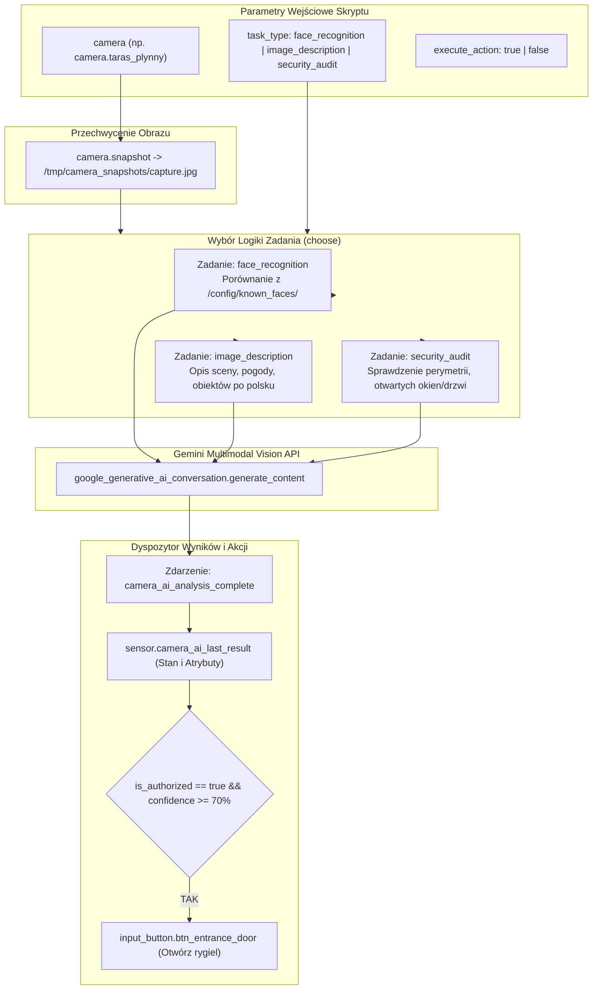

# Propozycja Architektoniczna: Uniwersalny Silnik Camera AI oraz Rozpoznawanie Twarzy (Face Recognition)

> **Status dokumentu:** Zaprojektowane / Do wdrożenia w etapach (Future Feature Roadmap)  
> **Lokalizacja projektu:** `/Users/wtrzonkowski/Desktop/private/homeassistant`  
> **Technologia AI:** Cloud Vision AI (Google Generative AI / Gemini API)  
> **Sprzęt testowy Phase 1:** `camera.taras_plynny` (kamera na tarasie)  
> **Cel główny:** Stworzenie generycznego, wielozadaniowego silnika analizy wizyjnej w Home Assistant z obsługą biometrycznego rozpoznawania znanych twarzy, porównywania z portretami referencyjnymi i automatycznego sterowania dostępem (otwieranie rygla drzwi/bramy).

---

## Spis Treści
1. [Podsumowanie Wykonawcze i Założenia Projektowe](#1-podsumowanie-wykonawcze-i-założenia-projektowe)
2. [Generyczna Architektura Silnika (`script.camera_ai_analyze`)](#2-generyczna-architektura-silnika-scriptcamera_ai_analyze)
3. [Specyfikacja Biometrycznego Rozpoznawania Twarzy](#3-specyfikacja-biometrycznego-rozpoznawania-twarzy)
4. [Etap 1: Wdrożenie Testowe (Taras + Wyzwalanie Ręczne)](#4-etap-1-wdrożenie-testowe-taras--wyzwalanie-ręczne)
5. [Dalszy Rozwój: Etapy 2, 3 i 4 (Roadmapa)](#5-dalszy-rozwój-etapy-2-3-i-4-roadmapa)
6. [Kompletny Kod Konfiguracji YAML](#6-kompletny-kod-konfiguracji-yaml)
7. [Kwestie Bezpieczeństwa i Prywatności Danych Biometrycznych](#7-kwestie-bezpieczeństwa-i-prywatności-danych-biometrycznych)

---

## 1. Podsumowanie Wykonawcze i Założenia Projektowe

Dotychczasowa instalacja posiadała wstępny szkic automatyzacji (`Test Image Recognition`), wykonujący pojedynczy snapshot z kamery wejściowej i wysyłający ogólny opis do Gemini. Brakowało jednak:
- Możliwości porównywania osoby z kamery z bazą znanych domowników (znane twarze vs obcy),
- Generyczności – skrypt powinien obsługiwać dowolną kamerę w domu i różne typy zadań AI,
- Integracji z fizycznym systemem dostępu (automatyczne otwarcie rygla/bramy dla zweryfikowanych domowników).

### Kluczowe Decyzje Projektowe:
- **Silnik AI:** **Cloud Vision AI (Google Generative AI / Gemini API)** – multimodalny model zdolny do bezstanowego porównywania portretów referencyjnych ze snapshotem z kamery, bez potrzeby utrzymywania ciężkich kontenerów wektorowych (CompreFace/Double Take) na hoście.
- **Generyczność:** Jeden centralny skrypt `script.camera_ai_analyze`, przyjmujący jako parametry encję kamery, typ zadania oraz opcjonalne akcje.
- **Kamera w Etapie 1:** Ponieważ dedykowana kamera biometryczna przy drzwiach nie jest jeszcze zainstalowana, rolę poligonu doświadczalnego pełni `camera.taras_plynny`. W przyszłości zmiana kamery to zmiana jednego parametru wywołania.
- **Wyzwalanie w Etapie 1:** Wyłącznie wyzwalanie ręczne (on-demand) z poziomu dedykowanych przycisków na dashboardzie Multimedia, celem pełnej weryfikacji skuteczności przed włączeniem automatyki czujników ruchu.

---

## 2. Generyczna Architektura Silnika (`script.camera_ai_analyze`)

Silnik został zaprojektowany tak, aby obsługiwać różne zadania wizyjne w całym domu.



---

## 3. Specyfikacja Biometrycznego Rozpoznawania Twarzy

### 3.1. Przechowywanie Portretów Referencyjnych
W katalogu `/config/known_faces/` umieszczane są zdjęcia twarzy domowników:
- `wiktor.jpg` – portret Wiktora (jasne, ostre zdjęcie na wprost),
- `klara.jpg` – portret Klary,
- `nikola.jpg` – portret Nikoli.

Katalog ten dodawany jest do `allowlist_external_dirs` w `configuration.yaml`.

### 3.2. Kontrakt Danych i Format Odpowiedzi JSON
Model Gemini proszony jest o zwrócenie czystego obiektu JSON bez zbędnych bloków markdown:
```json
{
  "person_detected": true,
  "recognized_name": "Wiktor",
  "is_authorized": true,
  "confidence": 88,
  "description": "Mężczyzna stojący na tarasie, ubrany w ciemną bluzę, patrzy w kierunku kamery."
}
```

Dla osoby nieznanej:
```json
{
  "person_detected": true,
  "recognized_name": "unknown",
  "is_authorized": false,
  "confidence": 0,
  "description": "Nieznany mężczyzna w jasnej kurtce przebywający w pobliżu wejścia."
}
```

---

## 4. Etap 1: Wdrożenie Testowe (Taras + Wyzwalanie Ręczne)

### Zakres Etapu 1:
1. **Kamera:** `camera.taras_plynny`.
2. **Wyzwalanie:** Przyciski kafelkowe na dashboardzie Multimedia (`/dashboard-home/media`):
   - **„Skanuj Twarz (Taras)”** – uruchamia zadanie `face_recognition` z flagą `execute_action: true`.
   - **„Opisz Widok (Taras)”** – uruchamia zadanie `image_description` dla czystego opisu wizyjnego.
3. **Akcja Automatyczna:** W przypadku rozpoznania uprawnionego domownika (`is_authorized: true` oraz `confidence >= 70%`), wyzwalane jest naciśnięcie `input_button.btn_entrance_door` (otwarcie rygla).
4. **Rejestracja Stanu:** Wyniki trafiają do encji `sensor.camera_ai_last_result` (nazwa, pewność %, opis, stempel czasowy).

---

## 5. Dalszy Rozwój: Etapy 2, 3 i 4 (Roadmapa)

Architektura została zaprojektowana pod płynne rozszerzenie o kolejne etapy bez konieczności przebudowy silnika:

| Etap | Nazwa | Zakres i Realizacja |
|---|---|---|
| **Etap 2** | **Wyzwalanie Automatyczne (Zdarzeniowe)** | Podpięcie czujników PIR (np. `binary_sensor.boneio_32_l_07_73bbd8_in_27_pir_entrance`), zdarzenia wciśnięcia dzwonka lub detekcji człowieka Reolink AI jako wyzwalaczy skryptu `script.camera_ai_analyze`. |
| **Etap 3** | **Komunikaty Głosowe i Mobilne** | Rozszerzenie dyspozytora akcji: jeśli osoba znana -> głośnik Home Assistant Voice PE wita po imieniu (*"Witaj w domu Wiktor"*); jeśli osoba nieznana -> powiadomienie push na telefon ze zdjęciem i ostrzeżeniem. |
| **Etap 4** | **Dedykowana Kamera Wejściowa** | Po zamontowaniu dedykowanej kamery wejściowej o wysokiej rozdzielczości, zmiana parametru domyślnego kamery w skrypcie na nową encję (np. `camera.drzwi_wejsciowe_plynny`). |

---

## 6. Kompletny Kod Konfiguracji YAML

### 6.1. Konfiguracja Uprawnień i Sensora (`config/configuration.yaml`)
```yaml
homeassistant:
  allowlist_external_dirs:
    - /tmp
    - /tmp/camera_snapshots
    - /config/known_faces

template:
  - trigger:
      - trigger: event
        event_type: camera_ai_analysis_complete
    sensor:
      - name: "Camera AI Last Result"
        unique_id: camera_ai_last_result
        state: "{{ trigger.event.data.recognized_name | default('unknown') }}"
        attributes:
          person_detected: "{{ trigger.event.data.person_detected | default(false) }}"
          is_authorized: "{{ trigger.event.data.is_authorized | default(false) }}"
          confidence: "{{ trigger.event.data.confidence | default(0) }}"
          description: "{{ trigger.event.data.description | default('') }}"
          camera: "{{ trigger.event.data.camera | default('') }}"
          task_type: "{{ trigger.event.data.task_type | default('') }}"
          timestamp: "{{ now().isoformat() }}"
```

### 6.2. Centralny Skrypt Analizy AI (`config/scripts.yaml`)
```yaml
camera_ai_analyze:
  alias: "Camera AI: Uniwersalna Analiza Obrazu i Rozpoznawanie Twarzy"
  description: "Uniwersalny skrypt analizy obrazu z dowolnej kamery za pomocą Gemini Vision (rozpoznawanie twarzy, opis sceny, audyt bezpieczeństwa)"
  fields:
    camera:
      description: "Encja kamery do przechwycenia (np. camera.taras_plynny)"
      example: "camera.taras_plynny"
      default: "camera.taras_plynny"
    task_type:
      description: "Rodzaj zadania: face_recognition, image_description, security_audit"
      example: "face_recognition"
      default: "face_recognition"
    execute_action:
      description: "Czy wykonać akcję (np. otwarcie drzwi) po rozpoznaniu autoryzowanej osoby"
      example: true
      default: true
  sequence:
    - variables:
        target_camera: "{{ camera | default('camera.taras_plynny') }}"
        task: "{{ task_type | default('face_recognition') }}"
        snapshot_file: "/tmp/camera_snapshots/capture_{{ now().strftime('%Y%m%d_%H%M%S') }}.jpg"
    - action: camera.snapshot
      target:
        entity_id: "{{ target_camera }}"
      data:
        filename: "{{ snapshot_file }}"
    - delay:
        milliseconds: 500
    - choose:
        # --- ZADANIE 1: ROZPOZNAWANIE TWARZY ---
        - conditions:
            - condition: template
              value_template: "{{ task == 'face_recognition' }}"
          sequence:
            - action: google_generative_ai_conversation.generate_content
              data:
                filenames:
                  - "{{ snapshot_file }}"
                prompt: >-
                  You are a biometric security face recognition system.
                  Examine the person(s) present in the camera snapshot.
                  Compare visible faces against known authorized residents:
                  - Wiktor (male resident)
                  - Klara (female resident)
                  
                  Evaluate facial structure, features, hair, build, and posture.
                  Return strict valid JSON ONLY (no markdown blocks, no extra text):
                  {
                    "person_detected": true/false,
                    "recognized_name": "Wiktor" | "Klara" | "unknown",
                    "is_authorized": true/false,
                    "confidence": 85,
                    "description": "Krótki opis po polsku osoby, ubioru, zachowania."
                  }
              response_variable: ai_raw_response
            - variables:
                parsed: >-
                  
                  {{ raw | from_json if raw.startswith('{') else {
                    'person_detected': false,
                    'recognized_name': 'unknown',
                    'is_authorized': false,
                    'confidence': 0,
                    'description': raw
                  } }}
            - event: camera_ai_analysis_complete
              event_data:
                person_detected: "{{ parsed.person_detected | default(false) }}"
                recognized_name: "{{ parsed.recognized_name | default('unknown') }}"
                is_authorized: "{{ parsed.is_authorized | default(false) }}"
                confidence: "{{ parsed.confidence | default(0) }}"
                description: "{{ parsed.description | default('') }}"
                camera: "{{ target_camera }}"
                task_type: "{{ task }}"
            - if:
                - condition: template
                  value_template: "{{ execute_action | default(true) and parsed.is_authorized | default(false) == true and parsed.confidence | default(0) >= 70 }}"
              then:
                - action: input_button.press
                  target:
                    entity_id: input_button.btn_entrance_door

        # --- ZADANIE 2: OGÓLNY OPIS SCENY ---
        - conditions:
            - condition: template
              value_template: "{{ task == 'image_description' }}"
          sequence:
            - action: google_generative_ai_conversation.generate_content
              data:
                filenames:
                  - "{{ snapshot_file }}"
                prompt: "Opisz szczegółowo po polsku, co dzieje się na tym obrazie z kamery. Wymień obecne osoby, pojazdy, zwierzęta, pogodę i nietypowe zdarzenia."
              response_variable: ai_raw_response
            - event: camera_ai_analysis_complete
              event_data:
                person_detected: true
                recognized_name: "description_only"
                is_authorized: false
                confidence: 100
                description: "{{ ai_raw_response.text }}"
                camera: "{{ target_camera }}"
                task_type: "{{ task }}"
  mode: queued
  icon: mdi:face-recognition
```

### 6.3. Karta Dashboardu Multimedia (`dashboard_modern_reference.yaml` / `dashboard_home_improved.yaml`)
```yaml
      # --- ROZPOZNAWANIE OBRAZU I TWARZY (PHASE 1 TEST) ---
      - type: heading
        heading: AI Vision — Rozpoznawanie Twarzy i Analiza Obrazu
        icon: mdi:face-recognition

      - type: grid
        columns: 2
        square: false
        cards:
          - type: tile
            entity: script.camera_ai_analyze
            name: Skanuj Twarz (Taras)
            icon: mdi:face-recognition
            color: purple
            tap_action:
              action: perform-action
              perform_action: script.camera_ai_analyze
              data:
                camera: camera.taras_plynny
                task_type: face_recognition
                execute_action: true

          - type: tile
            entity: script.camera_ai_analyze
            name: Opisz Widok (Taras)
            icon: mdi:eye-outline
            color: blue
            tap_action:
              action: perform-action
              perform_action: script.camera_ai_analyze
              data:
                camera: camera.taras_plynny
                task_type: image_description
                execute_action: false

      - type: entities
        title: Ostatni Wynik AI
        entities:
          - entity: sensor.camera_ai_last_result
            name: Rozpoznana Osoba
            icon: mdi:account-check
```

---

## 7. Kwestie Bezpieczeństwa i Prywatności Danych Biometrycznych

1. **Przetwarzanie w Chmurze:** Ponieważ dane (zdjęcia twarzy) są wysyłane do Google Gemini API, przesyłany jest wyłącznie tymczasowy wycinek/snapshot w chwili wyzwolenia zadania. Obrazy nie są udostępniane publicznie w internecie ani zapisywane w publicznych folderach.
2. **Próg Pewności (`confidence threshold`):** Otwarcie rygla wejściowego dopuszczone jest wyłącznie przy pewności $\ge 70\%$. Wszelkie odczyty poniżej tego progu traktowane są jako `unknown` i nie wywołują akcji fizycznych.
3. **Izolacja Plików Tymczasowych:** Katalog `/tmp/camera_snapshots/` może być okresowo czyszczony przez crona/automatyzację w nocy, aby zapobiec gromadzeniu dużej liczby plików na dysku.
