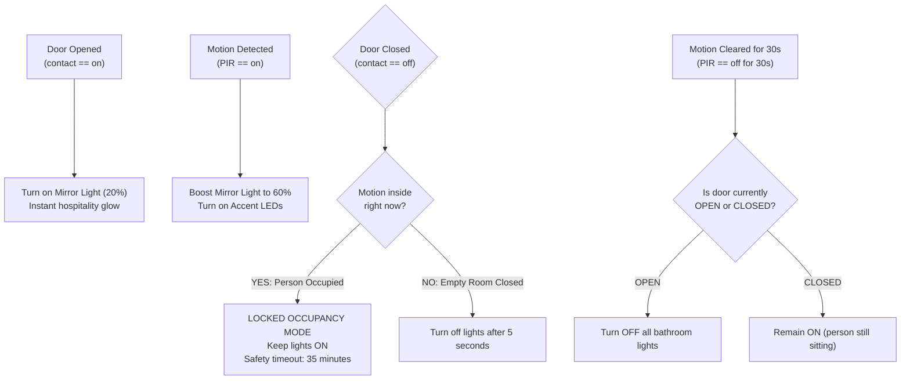

# PLACES_AND_BEHAVIORS.md — Room-by-Room Entity Directory & Behavioral Map

> **Scope:** Comprehensive, AI-optimized, and human-readable reference mapping every physical place (room, hall, exterior zone, rental unit) in the Home Assistant ecosystem (`local00`–`local06`) to its hardware channels, exact entity IDs, operational behaviors, automation logic, voice intents, and safety constraints.
>
> **Project Root:** `/Users/wtrzonkowski/Desktop/private/homeassistant`  
> **Related Architecture Files:** [`AGENTS.md`](file:///Users/wtrzonkowski/Desktop/private/homeassistant/AGENTS.md), [`AGENT.md`](file:///Users/wtrzonkowski/Desktop/private/homeassistant/AGENT.md), [`llms.txt`](file:///Users/wtrzonkowski/Desktop/private/homeassistant/llms.txt)

---

## 1. Architectural Hardware & Safety Foundation

Before reviewing individual places, the following hardware platforms and safety rules apply globally:

### 1.1 Hardware Platforms & Bus Topology

```
┌─────────────────────────────────────────────────────────────────────────────┐
│                          Central Home Assistant Host                        │
└──────┬──────────────────────┬──────────────────────┬────────────────────────┘
       │ Ethernet             │ Ethernet             │ Zigbee 3.0 (Ember USB)
       ▼                      ▼                      ▼
┌──────────────────┐   ┌──────────────────┐   ┌───────────────────────────────┐
│ BoneIO 32x10     │   │ BoneIO 8ch PWM   │   │ Zigbee2MQTT Network (Ch 11)   │
│ Relay Board      │   │ LED Dimmer       │   │ - Taras Bulb 1 & Bulb 2       │
│ boneio-32-l-07   │   │ boneio-dr-8ch-03 │   │ - Wireless PIR sensors        │
│ (230V Relays)    │   │ (24V PWM)        │   │ - Door/Window Reed contacts   │
└──────────────────┘   └──────────────────┘   └───────────────────────────────┘
```

1. **BoneIO 32x10 Relay Board (`boneio-32-l-07`):**
   - 32 × 230V high-power relay outputs (`light.boneio_32_l_07_new_light_01` to `light_20`).
   - 32 × Optoisolated digital inputs for physical wall switches, door reeds, and PIR sensors (`binary_sensor.boneio_32_l_07_73bbd8_in_*`).
2. **BoneIO 8-Channel PWM Dimmer (`boneio-dr-8ch-03-2c7fbc`):**
   - 8 × 24V PWM dimming channels for architectural LED strips and spots (`light.boneio_dr_8ch_03_2c7fbc_chl_01`–`chl_04` and `chr_01`–`chr_04`).
   - 8 × Low-voltage digital inputs for tactile wall switches.
3. **Shelly WiFi Controllers:**
   - `shellyrgbw2-814843`: Salon White/Color LED strip via native MQTT (`shellies/shellyrgbw2-814843/...`).
   - `shellyplusrgbwpm-9451dc0a83b4`: Salon 4-channel architectural profile LEDs (`light.shellyplusrgbwpm_9451dc0a83b4_light_0`..`3`).
   - `shellyrgbw2-c8c9a3399f35`: Mała Łazienka LED dual-channel accent lighting.
   - `shellyrgbw2-814843` (2nd channel): Kuchnia LED strip.
4. **Edge Microcontrollers (ESP32 DevKit V1 & TTGO T4):**
   - Zone heating controllers (`newHeatingController`) driving 230V manifold thermoelectric actuators.
   - OneWire DS18B20 digital temperature sensor buses.
   - TTGO T4 color TFT thermostat stations (`heatingStation`) communicating over MQTT and HTTP REST (`nodeApi`).
5. **Multimedia & Voice Devices:**
   - **Home Assistant Voice PE Satellite:** `media_player.home_assistant_voice_0a9bfd_media_player` (ESPHome, Nabu Casa Cloud TTS).
   - **Salon TCL Google TV:** Android TV Remote (`remote.salon_2`, `media_player.salon_2`) and Google Cast Target (`media_player.googletv8897_2`).

---

### 1.2 Critical Safety Constraints & Exclusion Rules

> [!CAUTION]
> **Power Supply Relay Protection Rule:**
> Four 230V BoneIO relays power low-voltage LED drivers and transformers. These relays **MUST NEVER** be toggled off by "All Lights Off" scripts, sleep routines, or presence leaving triggers. Turning off their mains input damages downstream smart controllers and cuts standby power.

| Protected Relay Entity | Switch Entity Wrapper | Circuit Served | Exclusion Enforcement |
|---|---|---|---|
| `light.boneio_32_l_07_new_light_18` | `switch.zasilanie_salon_dodatkowe` | Salon LED Transformers & Profiles | Excluded from `script.all_lights_off` & `TrybDobranoc` |
| `light.boneio_32_l_07_new_light_07` | `switch.zasilanie_sypialnia_garderoba` | Sypialnia & Garderoba LED Drivers | Excluded from `script.all_lights_off` & `TrybDobranoc` |
| `light.boneio_32_l_07_new_light_20` | `switch.zasilanie_mala_lazienka` | Mała Łazienka 24V LED Driver | Excluded from `script.all_lights_off` & `TrybDobranoc` |
| `light.boneio_32_l_07_new_light_11` | `switch.zasilanie_taras` | Taras Lighting Driver | Excluded from `script.all_lights_off` & `TrybDobranoc` |

> [!WARNING]
> **Door Strike Lock Domain Safety:**
> The physical electric strike lock is wired to BoneIO relay channel 23 (`light.boneio_32_l_07_73bbd8_door_23_relay`).  
> **NEVER expose this relay as a generic light.** It is wrapped in `lock.rygiel_drzwi_wejsciowych_lock` and triggered exclusively via `input_button.btn_entrance_door` with an automatic 2-minute safety turn-off timer.

---

## 2. Room-by-Room / Place-by-Place Matrix

```
┌─────────────────────────────────────────────────────────────────────────────┐
│                            PRIMARY RESIDENCE (local00)                      │
├───────────────────┬───────────────────┬───────────────────┬─────────────────┤
│ Salon (Living)    │ Kuchnia & Jadalnia│ Sypialnia Master  │ Mała Łazienka   │
├───────────────────┼───────────────────┼───────────────────┼─────────────────┤
│ Duża Łazienka     │ Wiatrołap & Hol   │ Korytarz Sypialnie│ Pokoje Dzieci   │
│ & Pralnia         │ Wejściowy         │ & Klatki Schodowe │ & Gabinet       │
├───────────────────┴───────────────────┴───────────────────┴─────────────────┤
│ Taras, Ogród, Podjazd & Bramy                                               │
├─────────────────────────────────────────────────────────────────────────────┤
│                       RENTAL APARTMENTS (local01 – local06)                 │
│ 6 independent suites × 3 climate zones (Glowny, Lazienka, Sypialnia)       │
└─────────────────────────────────────────────────────────────────────────────┘
```

---

### 2.1 Salon (Living Room)

- **Physical Location:** Ground floor central open living area (`local00`).
- **Purpose:** Primary family living, entertainment (TCL Google TV, Cinema mode), ambient and ceiling lighting.

#### Entity Directory
| Role / Subsystem | Entity ID | Device / Protocol | Description / Mapping |
|---|---|---|---|
| Ceiling Light | `light.salon_mqtt` | Shelly RGBW2 (MQTT) | Main ceiling light with RGBW color + white channel |
| Accent Strip | `light.shellyrgbw2_salon` | Shelly RGBW2 (WiFi) | Primary perimeter LED strip |
| Profile Strip Ch 1 | `light.shellyplusrgbwpm_9451dc0a83b4_light_0` | Shelly Plus RGBW PM | Architectural profile LED Channel 1 |
| Profile Strip Ch 2 | `light.shellyplusrgbwpm_9451dc0a83b4_light_1` | Shelly Plus RGBW PM | Architectural profile LED Channel 2 |
| Profile Strip Ch 3 | `light.shellyplusrgbwpm_9451dc0a83b4_light_2` | Shelly Plus RGBW PM | Architectural profile LED Channel 3 |
| Profile Strip Ch 4 | `light.shellyplusrgbwpm_9451dc0a83b4_light_3` | Shelly Plus RGBW PM | Architectural profile LED Channel 4 |
| Protected Power Supply | `light.boneio_32_l_07_new_light_18` / `switch.zasilanie_salon_dodatkowe` | BoneIO 32x10 Relay 18 | 230V mains transformer power (**PROTECTED**) |
| Motion PIR Sensor | `binary_sensor.boneio_32_l_07_73bbd8_in_27_pir_living_room` | BoneIO Digital Input 27 | Hardware PIR sensor in living area |
| Thermostat / Climate | `climate.local00_salon_termostat` | ESP32 PID / MQTT | Living room heating climate controller |
| Temperature Sensor | `sensor.local00_salon_temperature` | DS18B20 OneWire | Current room ambient temperature |
| Setpoint Sensor | `sensor.local00_salon_setpoint` | MQTT State | Target room temperature setpoint |
| Heating Actuator State | `sensor.local00_salon_heating_state` | ESP32 Relay State | Relay ON/OFF status for living room zone valve |
| Heating Routine | `sensor.local00_salon_routine` | nodeApi / MQTT | Active routine schedule name |
| Google TV Remote | `remote.salon_2` | Android TV Remote | TCL TV control (power, navigation, volume) |
| Google TV Media | `media_player.salon_2` | Android TV Remote | App launcher & playback control |
| Google TV Cast | `media_player.googletv8897_2` | Google Cast | Live HLS camera stream receiver |
| Scene: Cinema 1 | `scene.salon_kino_1` | HA Scene | Pre-configured cinema illumination scene |
| Color Selector | `input_select.salon_kolor_wybor` | HA Helper | Cycle script selector for living room colors |
| White Brightness | `input_number.kolor_bialy_salon` | HA Helper | White level (0–255) for MQTT ceiling light |
| Animation Mode | `input_select.shelly_mode` | HA Helper | Off / ON / Animation |
| Animation Type | `input_select.shelly_animation_type` | HA Helper | `script_1` to `script_6` (Cycle, Dim, Wave, Chase, Pulse, Rock) |
| Animation Brightness | `input_number.shelly_brightness` | HA Helper | Overall brightness (1–100%) for animation scripts |

#### Behaviors & Automations
1. **Motion Auto-On/Off (`PIR Livingroom ON` / `PIR Livingroom OFF`):**
   - *Trigger:* `binary_sensor.boneio_32_l_07_73bbd8_in_27_pir_living_room` transitions `off` -> `on`.
   - *Conditions:* `input_boolean.motion_lights_disabled == off`, time is between `input_datetime.dynamic_sunset` and `input_datetime.dynamic_dawn`.
   - *Action:* Activates ambient salon lighting; turns off after timeout when motion clears.
2. **Wall Button Sequences (`Light Salon ON Single Click`, `Light Salon Btn Click White Color Adjust`):**
   - Single click toggles `light.salon_mqtt`.
   - Double click / adjust cycles through white brightness thresholds: 5 -> 20 -> 50 -> 75 -> 100 via `script.light_salon_white_adjust`.
   - Button 07 cycles through preset color palette scripts (`script.light_salon_color_1`, `script.light_salon_color_2`, `script.light_salon_white_red_loop_20`) via `script.run_next_script_in_sequence`.
3. **Cinema Mode Integration (`script.salon_cinema_mode`):**
   - *Invocation:* Say *"tryb kino w salonie"* / *"cinema mode in living room"* or press Cinema tile on `/dashboard-home/media`.
   - *Logic:* Turns on `remote.salon_2`, activates `scene.salon_kino_1`. If after dusk (`input_datetime.dynamic_sunset`), forces `input_select.salon_kolor_wybor` to option 2 (`script.light_salon_color_2`), executes it, and turns off overhead ceiling fixture `light.salon_mqtt`.
   - *Turn Off:* Say *"wyłącz tryb kino"* -> powers down TV and stops Cast stream.
4. **Shelly 4-Channel Animation Engine (`Shelly Mode Handler`, `Shelly RGBW Continuous Animation Loop`):**
   - Handles animated breathing, chase, wave, and rock patterns across channels 0–3 using `input_select.shelly_animation_type`.

#### Interactive Controls
- **Voice Intents (PL):** *"włącz tryb kino"*, *"wyłącz tryb kino"*, *"włącz [netflix/youtube/disney/max/spotify/prime] na telewizorze"*, *"głośniej/ciszej/wycisz telewizor"*, *"pokaż [kamerę] na telewizorze"*, *"zamknij podgląd kamery"*.
- **Voice Intents (EN):** *"cinema mode"*, *"open [app] on tv"*, *"volume up/down/mute tv"*, *"show [camera] on tv"*, *"stop camera on tv"*.
- **Dashboard Views:** `/dashboard-home` (overview), `/dashboard-home/media` (TV & app launcher grid, D-pad remote, cameras), `/dashboard-home/oswietlenie`.

---

### 2.2 Kuchnia & Jadalnia (Kitchen & Dining)

- **Physical Location:** Ground floor open space adjacent to living room (`local00`).
- **Purpose:** Cooking, food preparation, dining table, island workstation.

#### Entity Directory
| Role / Subsystem | Entity ID | Device / Protocol | Description / Mapping |
|---|---|---|---|
| Main Kitchen Light | `light.boneio_dr_8ch_03_2c7fbc_chl_04` | BoneIO 8ch Dimmer ChL 04 | Primary 24V ceiling spot lighting |
| Kitchen Island Lamp | `light.boneio_32_l_07_new_light_05` | BoneIO 32x10 Relay 05 | 230V pendant light over kitchen island |
| Dining Table Lamp | `light.boneio_32_l_07_new_light_06` | BoneIO 32x10 Relay 06 | 230V chandelier over dining table |
| Kitchen LED Under-cabinet | `light.shellyrgbw2_814843` | Shelly RGBW2 | 24V under-cabinet countertop LED |
| Wall Switch Input | `binary_sensor.boneio_dr_8ch_03_2c7fbc_in_04` | BoneIO Dimmer Input 04 | Physical push-button switch in kitchen |
| Kitchen Helper | `input_boolean.kitchen_helper` | HA Helper | Tracks manual kitchen override state |
| Motion PIR Sensor | `binary_sensor.boneio_32_l_07_73bbd8_in_28_pir_kitchen` | BoneIO Digital Input 28 | Kitchen motion detection sensor |
| Temperature Sensor | `sensor.local00_kuchnia_temperature` | DS18B20 OneWire | Room temperature sensor |
| Setpoint Sensor | `sensor.local00_kuchnia_setpoint` | MQTT State | Target setpoint temperature |
| Barometric Pressure | `sensor.local00_kuchnia_pressure` | BMP280 Sensor | Kitchen barometric pressure (hPa) |
| Controller Temperature | `sensor.local00_kuchnia_temperature_controller` | DS18B20 OneWire | Heating controller sensor reading |
| Heating Actuator State | `sensor.local00_kuchnia_heating_state` | ESP32 Relay State | Relay ON/OFF status for kitchen floor heating loop |
| Heating Routine | `sensor.local00_kuchnia_routine` | nodeApi / MQTT | Active routine schedule name |

#### Behaviors & Automations
1. **Wall Switch Toggle (`BTN_KITCHEN_CHANGE`):**
   - *Trigger:* State change on `binary_sensor.boneio_dr_8ch_03_2c7fbc_in_04`.
   - *Action:* If `light.boneio_dr_8ch_03_2c7fbc_chl_04` is off, turns it on to 75% brightness and sets `input_boolean.kitchen_helper = on`. If on, turns off light and helper.
2. **Kitchen Motion Control (`PIR Kitchen ON` / `PIR Kitchen Off`):**
   - *Trigger:* `binary_sensor.boneio_32_l_07_73bbd8_in_28_pir_kitchen` transitions `on`.
   - *Conditions:* `input_boolean.motion_lights_disabled == off`, time between `input_datetime.dynamic_sunset` and `input_datetime.dynamic_dawn`, `input_boolean.kitchen_helper == off`.
   - *Action:* Illuminates kitchen main spots to 40%; turns off automatically 45s after motion clears.
3. **Dining Scene:**
   - Independent control of pendant lamp `light.boneio_32_l_07_new_light_06` over dining table via wall switch or voice.

#### Interactive Controls
- **Voice Intents (PL):** *"włącz kuchnię"*, *"zgaś kuchnię"*, *"włącz wyspę"*, *"włącz światło nad stołem"*, *"ile stopni w kuchni"*.
- **Voice Intents (EN):** *"turn on kitchen"*, *"turn off kitchen light"*, *"kitchen island on"*, *"dining light on"*.

---

### 2.3 Sypialnia (Master Bedroom)

- **Physical Location:** Upper level private master suite (`local00`).
- **Purpose:** Sleeping, wardrobe/closet area, motorized black-out roller shutter automation, cinema mode.

#### Entity Directory
| Role / Subsystem | Entity ID | Device / Protocol | Description / Mapping |
|---|---|---|---|
| Ceiling Main Light | `light.boneio_32_l_07_new_light_17` | BoneIO 32x10 Relay 17 | Primary 230V ceiling fixture |
| Decorative Sconces | `light.boneio_32_l_07_new_light_08` | BoneIO 32x10 Relay 08 | Bedside reading sconces (kinkiety) |
| Wardrobe Power Supply | `light.boneio_32_l_07_new_light_07` / `switch.zasilanie_sypialnia_garderoba` | BoneIO 32x10 Relay 07 | 230V mains driver for wardrobe LED (**PROTECTED**) |
| Roller Shutter Motor UP | Relay Switch `61a94e2cc...` | Relay board | 230V directional motor contact: UP |
| Roller Shutter Motor DOWN | Relay Switch `28f594227...` | Relay board | 230V directional motor contact: DOWN |
| Roller Shutter Button UP | `input_button.roleta_sypialnia_up` | HA Helper | Triggers full roll up (35 seconds) |
| Roller Shutter Button DOWN | `input_button.roleta_sypialnia_down` | HA Helper | Triggers roll down almost closed |
| Thermostat / Climate | `climate.local00_sypialnia_termostat` | ESP32 PID / MQTT | Master bedroom heating zone |
| Temperature Sensor | `sensor.local00_sypialnia_temperature` | DS18B20 OneWire | Room temperature sensor |
| Setpoint Sensor | `sensor.local00_sypialnia_setpoint` | MQTT State | Target setpoint temperature |
| Heating Actuator State | `sensor.local00_sypialnia_heating_state` | ESP32 Relay State | Relay ON/OFF status for bedroom zone valve |
| Heating Routine | `sensor.local00_sypialnia_routine` | nodeApi / MQTT | Active routine schedule name |

#### Behaviors & Automations
1. **Motorized Shutter Control Scripts (`config/scripts.yaml`):**
   - `script.roller_bedroom_on`: Energizes UP relay for 35s, then de-energizes.
   - `script.roller_bedroom_down`: Energizes DOWN relay for 30s, then de-energizes.
   - `script.roller_bedroom_down_almost`: Executes full down (30s) followed by a 3s reverse pulse to leave ventilation/slat gaps.
   - `script.roller_bedroom_up_1_3`: Energizes UP for 11s (1/3 open).
   - `script.roller_bedroom_up_1_5`: Energizes UP for 6s (slat ventilation crack).
2. **Time-Based Automated Shutter Schedules:**
   - **Night Mode (`Night time roller down`):** At `input_datetime.pora_nocna` (23:00) -> calls `script.roller_bedroom_down_almost`.
   - **Morning Wakeup (`Day time`):** Mon–Fri at `input_datetime.pora_pobudka` (07:00) and Sat–Sun at `input_datetime.pora_pobudka_weekend` (08:30) -> calls `script.roller_bedroom_on`.
   - **Sunrise Alignment (`Sunrise time roller`):** Additional weekday triggers at 05:40 / 06:40.
3. **Master Bedroom Cinema Mode (`bedroom_cinema_on` / `bedroom_cinema_off`):**
   - Turns on bedroom TV receiver and triggers `script.roller_bedroom_down_almost`.
4. **Goodnight / Leaving Routines (`TrybDobranoc`, `TrybWychodze`):**
   - *"Dobranoc"* -> calls `script.all_lights_off` and `script.roller_bedroom_down_almost`.
   - Protected power supply `switch.zasilanie_sypialnia_garderoba` stays energized.

#### Interactive Controls
- **Voice Intents (PL):** *"otwórz roletę w sypialni"*, *"zamknij roletę w sypialni"*, *"uchyl roletę w sypialni"*, *"zatrzymaj roletę"*, *"dobranoc"*, *"dzień dobry"*.
- **Voice Intents (EN):** *"open bedroom blinds"*, *"close bedroom blinds"*, *"tilt bedroom blinds"*, *"stop blinds"*, *"good night"*, *"good morning"*.

---

### 2.4 Mała Łazienka (Powder Room / Half-Bath)

- **Physical Location:** Ground floor guest bathroom near entrance hall (`local00`).
- **Purpose:** Guest toilet, sink, mirror, smart occupancy detection avoiding darkness while occupied.

#### Entity Directory
| Role / Subsystem | Entity ID | Device / Protocol | Description / Mapping |
|---|---|---|---|
| Mirror Accent Light | `light.boneio_dr_8ch_03_2c7fbc_chr_02` | BoneIO 8ch Dimmer ChR 02 | 24V dimmable mirror surround fixture |
| Protected Power Supply | `light.boneio_32_l_07_new_light_20` / `switch.zasilanie_mala_lazienka` | BoneIO 32x10 Relay 20 | 230V driver for bathroom LEDs (**PROTECTED**) |
| Decorative LED Ch 1 | `light.shellyrgbw2_c8c9a3399f35` | Shelly RGBW2 Ch 1 | Accent strip channel 1 |
| Decorative LED Ch 2 | `light.shellyrgbw2_c8c9a3399f35_channel_2` | Shelly RGBW2 Ch 2 | Accent strip channel 2 |
| Door Reed Contact | `binary_sensor.0b01f72c9c4ac88da803fac8ac530ead` | Zigbee Door Sensor | Magnetic contact sensor on bathroom door |
| Occupancy / Motion PIR | `binary_sensor.1ad082b889081e2f5fde537a65b68d51` / `...in_29` | Zigbee PIR / BoneIO In 29 | High-sensitivity presence sensor |
| Temperature Sensor | `sensor.local00_malalazienka_temperature` | DS18B20 OneWire | Room ambient temperature |
| Setpoint Sensor | `sensor.local00_malalazienka_setpoint` | MQTT State | Target room temperature setpoint |
| Heating Actuator State | `sensor.local00_malalazienka_heating_state` | ESP32 Relay State | Relay ON/OFF status for half-bath loop |
| Heating Routine | `sensor.local00_malalazienka_routine` | nodeApi / MQTT | Active routine schedule name |

#### Behaviors & Smart Occupancy Automation Logic



1. **`Advanced Bathroom Automation` (`id: 1754333312816`):**
   - **Door Opened (`door_opened`):** Turns on `light.boneio_dr_8ch_03_2c7fbc_chr_02` at 20% brightness for welcoming illumination without blinding at night.
   - **Motion Detected (`motion_detected`):** Boosts mirror light to 60% and activates LED strips. If door is closed, maintains 20% backlight.
   - **Motion Cleared for 30s (`motion_cleared`):** If door is open, turns off all lights.
   - **Door Closed (`door_closed`):** Checks if motion is present. If NO motion detected after 5 seconds, turns off mirror light (preventing lights left on when closing empty door). If motion IS detected, locks state into occupied mode for up to 35 minutes (`Reed_Small_Bathroom_OFF`).
2. **Safety Rule:** Relay `light.boneio_32_l_07_new_light_20` powers the 24V bus and is never switched off during room vacancies.

#### Interactive Controls
- **Voice Intents (PL):** *"włącz małą łazienkę"*, *"zgaś małą łazienkę"*, *"temperatura w małej łazience"*.
- **Voice Intents (EN):** *"turn on small bathroom"*, *"turn off small bathroom"*, *"small bathroom temperature"*.

---

### 2.5 Duża Łazienka & Pralnia (Full Bath & Laundry)

- **Physical Location:** Upper residential floor (`local00`).
- **Purpose:** Primary bathroom (bathtub, shower, vanity) and dedicated laundry utility room.

#### Entity Directory
| Role / Subsystem | Entity ID | Device / Protocol | Description / Mapping |
|---|---|---|---|
| Main Bath Light | `light.boneio_32_l_07_new_light_10` | BoneIO 32x10 Relay 10 | Primary 230V bathroom ceiling lighting |
| Bath Door Reed | Door sensor entity | Zigbee Sensor | Door contact sensor (`Reed Bathroom Large ON/OFF`) |
| Bath Thermostat | `climate.local00_lazienka_termostat` | ESP32 PID / MQTT | Large bathroom heating climate controller |
| Bath Temperature | `sensor.local00_lazienka_temperature` | DS18B20 OneWire | Room temperature sensor |
| Bath Setpoint | `sensor.local00_lazienka_setpoint` | MQTT State | Target temperature setpoint |
| Bath Heating State | `sensor.local00_lazienka_heating_state` | ESP32 Relay State | Relay ON/OFF status for bath floor loop |
| Bath Routine | `sensor.local00_lazienka_routine` | nodeApi / MQTT | Active routine schedule name |
| Laundry Main Light | `light.boneio_32_l_07_new_light_09` | BoneIO 32x10 Relay 09 | Primary 230V laundry room lighting |
| Laundry Motion PIR | Motion sensor entity | Zigbee PIR | Laundry motion sensor (`Motion Pralnia ON/OFF`) |
| Utility Temperature | `sensor.local00_gospodarcze_temperature` | DS18B20 OneWire | Utility room temperature |
| Utility Setpoint | `sensor.local00_gospodarcze_setpoint` | MQTT State | Target setpoint temperature |
| Utility Heating State | `sensor.local00_gospodarcze_heating_state` | ESP32 Relay State | Relay ON/OFF status for utility loop |

#### Behaviors & Automations
1. **Large Bathroom Door Reed (`Reed Bathroom Large ON` / `OFF`):**
   - Opening the door triggers ceiling light `light.boneio_32_l_07_new_light_10`.
   - Closing or vacancy turns off light after door re-opens or inactivity timeout.
2. **Laundry Motion Automation (`Motion Pralnia ON` / `Motion Pralnia OFF`):**
   - Motion detected turns on `light.boneio_32_l_07_new_light_09`.
   - Absence of motion for 60s automatically turns off laundry lights.

#### Interactive Controls
- **Voice Intents (PL):** *"włącz dużą łazienkę"*, *"włącz pralnię"*, *"zgaś pralnię"*, *"temperatura w łazience"*.
- **Voice Intents (EN):** *"turn on bathroom"*, *"turn on laundry room"*, *"laundry light off"*.

---

### 2.6 Wiatrołap, Hol Wejściowy & Drzwi (Vestibule, Hall, Electric Strike Lock & Voice PE)

- **Physical Location:** Main entrance foyer, front door, hallway connecting living room (`local00`).
- **Purpose:** Access control (RFID tags, strike lock), welcome lighting, voice satellite station for house-wide audio/radio and TTS announcements.

#### Entity Directory
| Role / Subsystem | Entity ID | Device / Protocol | Description / Mapping |
|---|---|---|---|
| Vestibule Ceiling Light | `light.boneio_32_l_07_new_light_01` | BoneIO 32x10 Relay 01 | 230V main ceiling fixture in wiatrołap |
| Entrance Hall Dimmer | `light.boneio_dr_8ch_03_2c7fbc_chl_01` | BoneIO 8ch Dimmer ChL 01 | 24V hallway recessed LED line |
| Hallway Wall Switch | `binary_sensor.boneio_dr_8ch_03_2c7fbc_in_01` | BoneIO Dimmer Input 01 | Physical push button at entry |
| Manual Hallway Helper | `input_boolean.hall_entrance_input_manual`| HA Helper | Tracks manual wall button override |
| Hall Mirror Accent | `light.boneio_dr_8ch_03_2c7fbc_chr_04` | BoneIO 8ch Dimmer ChR 04 | 24V mirror backlight near front door |
| Electric Strike Lock (Relay)| `light.boneio_32_l_07_73bbd8_door_23_relay` | BoneIO Relay 23 | Hardware coil driver (**SAFETY WRAPPED**) |
| Electric Strike Lock (Entity)| `lock.rygiel_drzwi_wejsciowych_lock` | Template Lock | Secure lock representation in HA |
| Door Strike Trigger Button | `input_button.btn_entrance_door` | HA Helper | Triggers 2-minute pulse to energize strike |
| Front Door Reed Contact | `binary_sensor.boneio_32_l_07_73bbd8_in_25_reed_entrance_door` | BoneIO Digital Input 25 | Magnetic reed sensor on front door leaf |
| Entrance Motion PIR | `binary_sensor.boneio_32_l_07_73bbd8_in_26_pir_entrance` | BoneIO Digital Input 26 | Entrance vestibule motion sensor |
| Voice Assistant Satellite | `media_player.home_assistant_voice_0a9bfd_media_player` | HA Voice PE (ESPHome) | Main smart speaker, mic array & Nabu Casa TTS |
| Active Radio Station Helper | `input_select.last_radio_station` | HA Helper | Stores current/last station (8 presets) |
| Vestibule Temperature | `sensor.local00_wiatrolap_temperature` | DS18B20 OneWire | Vestibule ambient temperature |
| Vestibule Setpoint | `sensor.local00_wiatrolap_setpoint` | MQTT State | Target temperature setpoint |
| Vestibule Heating State | `sensor.local00_wiatrolap_heating_state` | ESP32 Relay State | Relay ON/OFF status for vestibule loop |
| Entrance Hall Temp | `sensor.local00_holwejscie_temperature` | DS18B20 OneWire | Hall ambient temperature |
| Entrance Hall Setpoint | `sensor.local00_holwejscie_setpoint` | MQTT State | Target temperature setpoint |
| Entrance Hall Heating State| `sensor.local00_holwejscie_heating_state`| ESP32 Relay State | Relay ON/OFF status for hall loop |

#### Behaviors & Automations
1. **Front Door Electric Strike Pulse (`BTN Entrance Door Trigger`, `Entrance Door Open`):**
   - *Trigger:* `input_button.btn_entrance_door` pressed (via voice, dashboard tile, or RFID tag).
   - *Action:* Energizes relay `light.boneio_32_l_07_73bbd8_door_23_relay`, sets a 2-minute safety delay, then turns off relay.
   - *Instant Auto-Shutoff:* As soon as the door is opened (`binary_sensor...reed_entrance_door` or lock unlatched), the relay de-energizes immediately without waiting for the 2-minute timeout.
2. **RFID Tag Door Access & Alarm Disarm (`Door tag`):**
   - *Trigger:* RFID tag `0a9cf91e-baf1-48c1-9982-281d82b507aa` scanned at exterior reader.
   - *Condition:* If alarm is disarmed -> unlocks door immediately via `input_button.btn_entrance_door`.
   - *Security Check:* If alarm is armed, verifies presence of family members (`person.wiktor`, `person.magda`, `device_tracker.nikola_samsung`). If recognized, disarms alarm with code `1111` and pulses strike lock. If not recognized, sends warning notification: *"Ktoś chce otworzyć drzwi"*.
3. **RFID Tag Arm Home Away (`Tag Alarm ON`):**
   - *Trigger:* Scanning tag `zamykanie drzwi` -> sends notification *"Uzbrajanie domu"*, starts 15s exit delay, arms alarm to `armed_away` with code `1111`.
4. **Entrance Hall Motion & Door Logic (`PIR Entrance ON` / `OFF`, `Reed Main Door on` / `OFF`):**
   - Motion between dusk and dawn turns on vestibule light `light.boneio_32_l_07_new_light_01`.
   - Turns off 15 seconds after motion ceases.
   - Wall button `binary_sensor.boneio_dr_8ch_03_2c7fbc_in_01` overrides auto-off by setting `input_boolean.hall_entrance_input_manual`.
5. **Stateful Radio & Voice Satellite Subsystem (`play_radio`, `stop_radio`, `morning_radio_schedule`):**
   - Saying *"włącz radio"* resumes last selected station from `input_select.last_radio_station` (defaults to Eska Rock).
   - Changing or switching stations by voice (*"zmień stację na [stacja]"*, *"przełącz na [stacja]"*, *"włącz [stacja]"*) seamlessly resolves aliases and transitions live streams.
   - Morning alarm: Mon–Fri at `pora_pobudka` plays Radio ZET; Sat–Sun at `pora_pobudka_weekend` plays Antyradio.
   - Changing the dropdown in Lovelace automatically re-streams to the Voice PE speaker via `radio_station_changed_auto_play` (guarded against recursive re-entry).
   - Pstryk cheapest window announcement spoke aloud automatically via Nabu Casa TTS.

#### Interactive Controls
- **Voice Intents (PL):** *"otwórz drzwi"*, *"otwórz rygiel"*, *"wpuść gości"*, *"włącz radio [stacja]"*, *"zmień stację na [stacja]"*, *"przełącz na [stacja]"*, *"zatrzymaj radio"*, *"głośniej/ciszej radio"*, *"kiedy jest najtańszy prąd"*, *"kiedy wywóz śmieci"*, *"wychodzę z domu"*.
- **Voice Intents (EN):** *"open front door"*, *"unlock door"*, *"play radio [station]"*, *"switch/change radio to [station]"*, *"stop radio"*, *"radio volume up/down"*, *"when is cheap energy"*, *"when is trash pickup"*.

---

### 2.7 Korytarz Sypialnie & Schody (Staircase & Bedroom Hallways)

- **Physical Location:** Central corridor leading to upper bedrooms and double staircase (`local00`).
- **Purpose:** Safe night transition between living areas and bedrooms, accent sconces, floor heating.

#### Entity Directory
| Role / Subsystem | Entity ID | Device / Protocol | Description / Mapping |
|---|---|---|---|
| Bedroom Hallway Line | `light.boneio_dr_8ch_03_2c7fbc_chl_02` | BoneIO 8ch Dimmer ChL 02 | 24V ceiling LED line along bedroom corridor |
| Hallway Wall Sconces | `light.boneio_dr_8ch_03_2c7fbc_chr_01` | BoneIO 8ch Dimmer ChR 01 | 24V wall-mounted architectural wash lights |
| Bedroom Corridor PIR | `binary_sensor.boneio_32_l_07_73bbd8_in_31_pir_hall_bedroom` | BoneIO Digital Input 31 | Hardware PIR sensor in bedroom hall |
| Hall Sypialnia Temp | `sensor.local00_holsypialnia_temperature` | DS18B20 OneWire | Corridor ambient temperature |
| Hall Sypialnia Setpoint | `sensor.local00_holsypialnia_setpoint` | MQTT State | Target temperature setpoint |
| Hall Sypialnia Heating State| `sensor.local00_holsypialnia_heating_state`| ESP32 Relay State | Relay ON/OFF status for corridor loop |
| Staircase Floor 1 Climate | `climate.local00_klatka1p_termostat` | ESP32 PID / MQTT | Staircase Level 1 climate entity |
| Staircase Floor 1 Temp | `sensor.local00_klatka1p_controler_temperature` | DS18B20 OneWire | Staircase Level 1 ambient temperature |
| Staircase Floor 1 Heating State| `sensor.local00_klatka1p_heating_state` | ESP32 Relay State | Heating relay state for Staircase 1 |
| Staircase Floor 2 Climate | `climate.local00_klatka2p_termostat` | ESP32 PID / MQTT | Staircase Level 2 climate entity |
| Staircase Floor 2 Temp | `sensor.local00_klatka2p_controler_temperature` | DS18B20 OneWire | Staircase Level 2 ambient temperature |
| Staircase Floor 2 Heating State| `sensor.local00_klatka2p_heating_state` | ESP32 Relay State | Heating relay state for Staircase 2 |

#### Behaviors & Automations
1. **Bedroom Corridor Motion (`PIR Korytarz Sypialnia ON` / `OFF`):**
   - *Trigger:* Motion detected on `in_31`.
   - *Action:* If after dusk (`input_datetime.dynamic_sunset`), illuminates hallway line `chl_02` to soft transit level; turns off 30s after motion clears.
2. **Staircase Heating PID Regulation:**
   - Both Level 1 and Level 2 staircases run independent PID heating loops responding to `local00/Klatka1P/details` and `local00/Klatka2P/details`.

#### Interactive Controls
- **Voice Intents (PL):** *"włącz korytarz przy sypialniach"*, *"podświetlenie ściany w korytarzu"*, *"temperatura na klatce schodowej"*.
- **Voice Intents (EN):** *"hallway light on"*, *"staircase temperature"*.

---

### 2.8 Pokoje Dziecięce (Klara, Nikola) & Gabinet (Office)

- **Physical Location:** Upper level private bedrooms and home office study (`local00`).
- **Purpose:** Children's living/study rooms, dedicated home office, independent climate loops.

#### Entity Directory
| Role / Subsystem | Entity ID | Device / Protocol | Description / Mapping |
|---|---|---|---|
| Klara Main Light | `light.boneio_32_l_07_new_light_16` | BoneIO 32x10 Relay 16 | Primary 230V ceiling light in Klara's room |
| Klara Thermostat | `climate.local00_klara_termostat` | ESP32 PID / MQTT | Heating climate controller |
| Klara Temperature | `sensor.local00_klara_temperature` | DS18B20 OneWire | Room temperature sensor |
| Klara Setpoint | `sensor.local00_klara_setpoint` | MQTT State | Target setpoint temperature |
| Klara Heating State | `sensor.local00_klara_heating_state` | ESP32 Relay State | Relay ON/OFF status for Klara loop |
| Klara Routine | `sensor.local00_klara_routine` | nodeApi / MQTT | Active routine schedule name |
| Nikola Main Light | `light.boneio_32_l_07_new_light_14` | BoneIO 32x10 Relay 14 | Primary 230V ceiling light in Nikola's room |
| Nikola Thermostat | `climate.local00_nikola_termostat` | ESP32 PID / MQTT | Heating climate controller |
| Nikola Temperature | `sensor.local00_nikola_temperature` | DS18B20 OneWire | Room temperature sensor |
| Nikola Setpoint | `sensor.local00_nikola_setpoint` | MQTT State | Target setpoint temperature |
| Nikola Heating State | `sensor.local00_nikola_heating_state` | ESP32 Relay State | Relay ON/OFF status for Nikola loop |
| Nikola Routine | `sensor.local00_nikola_routine` | nodeApi / MQTT | Active routine schedule name |
| Gabinet Night Light | `light.boneio_32_l_07_new_light_19` | BoneIO 32x10 Relay 19 | 230V soft ambient light in Office |
| Gabinet Thermostat | `climate.local00_gabinet_termostat` | ESP32 PID / MQTT | Office heating climate controller |
| Gabinet Temperature | `sensor.local00_gabinet_temperature` | DS18B20 OneWire | Room temperature sensor |
| Gabinet Setpoint | `sensor.local00_gabinet_setpoint` | MQTT State | Target setpoint temperature |
| Gabinet Heating State | `sensor.local00_gabinet_heating_state` | ESP32 Relay State | Relay ON/OFF status for office loop |
| Gabinet Routine | `sensor.local00_gabinet_routine` | nodeApi / MQTT | Active routine schedule name |

#### Behaviors & Automations
1. **Climate Schedules:** Each room follows dedicated morning/evening temperature profiles managed via `nodeApi` routine schedules.
2. **Voice Alias Resolution:** Voice commands match aliases configured in `customize.yaml` (e.g. *"u Klary"*, *"w pokoju dziecka"*, *"w biurze"*).

#### Interactive Controls
- **Voice Intents (PL):** *"włącz pokój Klary"*, *"zgaś u Nikoli"*, *"włącz światło w gabinecie"*, *"ustaw 21 stopni u Klary"*, *"temperatura w gabinecie"*.
- **Voice Intents (EN):** *"turn on Klara's room"*, *"turn off Nikola's light"*, *"office light on"*, *"set temperature in office to 21"*.

---

### 2.9 Taras, Ogród & Podjazd (Terrace dual lamps, Garden, Driveway, Gate cover & Cameras)

- **Physical Location:** Outdoor perimeters, patio terrace, garden boundary, front driveway, sliding entrance gate.
- **Purpose:** Perimeter security, driveway illumination, sliding gate access, outdoor relaxation lighting, video surveillance, camera casting to TV.

#### Entity Directory
| Role / Subsystem | Entity ID | Device / Protocol | Description / Mapping |
|---|---|---|---|
| Terrace Dual Light Group | `light.taras_lampy` | Light Group (`configuration.yaml`) | Unified group toggling Bulb 1 & 2 together |
| Terrace Left Lamp | `light.bulb_1` | Zigbee 3.0 Light | Left patio architectural luminaire |
| Terrace Right Lamp | `light.bulb_2` | Zigbee 3.0 Light | Right patio architectural luminaire |
| Protected Power Supply | `light.boneio_32_l_07_new_light_11` / `switch.zasilanie_taras` | BoneIO 32x10 Relay 11 | 230V driver for outdoor fixtures (**PROTECTED**) |
| Driveway Floodlight | `light.boneio_32_l_07_new_light_12` | BoneIO 32x10 Relay 12 | 230V driveway lighting fixture |
| Sliding Entrance Gate | `cover.brama_wynajem_zaslona` | Cover Actuator | Motorized sliding gate (open/close/stop) |
| Front Camera IR Light | `light.520a_infra_red_lights_in_night_mode` | Reolink Camera Entity | Front camera night-vision infrared array |
| Security Siren | `siren.reolink_duo_floodlight_poe_syrena` | Reolink POE Siren | High-decibel perimeter audible alarm siren |
| Camera: Podwórze | `camera.reolink_duo_floodlight_poe_plynny_2` | Reolink Duo Floodlight POE | Dual-lens wide-angle backyard surveillance |
| Camera: Wejście | `camera.rlc_822a_plynny` | Reolink RLC-822A POE | 4K optical zoom front entrance camera |
| Camera: Taras | `camera.taras_plynny` | Reolink POE | High-definition patio/terrace camera |
| Camera: Ogród | `camera.rlc_820a_niska_rozdzielczosc` | Reolink RLC-820A POE | Rear garden perimeter camera |
| Camera: Front / Brama | `camera.520a_plynny` | Reolink 520A POE | Driveway & gate surveillance camera |
| Garden Reed Contact | Reed sensor entity | Zigbee Sensor | Garden gate contact (`Merged Garden Reed Automation`) |
| Terrace Motion PIR | Motion sensor entity | Zigbee PIR | Patio motion sensor (`Motion Taras ON/OFF`) |
| Camera AI Last Plate | `sensor.camera_ai_last_plate` | Template Sensor | Last recognized license plate & vehicle attributes |
| Camera AI Last Result | `sensor.camera_ai_last_result` | Template Sensor | Last vision AI result (face/plate/description) |
| Camera AI Gate Auto-Open | `input_boolean.camera_ai_gate_auto_open` | HA Helper | Master enable switch for AI automatic gate opening |
| Camera AI Gate Cooldown | `input_datetime.camera_ai_last_gate_trigger` | HA Helper | Timestamp of last gate trigger for debounce cooldown |

#### Behaviors & Automations
1. **Unified Terrace Lighting (`light.taras_lampy`):**
   - Controls both `light.bulb_1` and `light.bulb_2` synchronously via voice or dashboard.
   - Protected power supply `switch.zasilanie_taras` ensures continuous power to the Zigbee mesh radios in the bulbs.
2. **Driveway & Gate Voice Control (`OtworzBrame`, `ZamknijBrame`):**
   - Voice trigger *"otwórz bramę"* / *"otwórz wjazd"* commands `cover.brama_wynajem_zaslona` to open.
   - *"zamknij bramę"* commands cover to close.
3. **Terrace & Driveway Motion Lighting (`Motion Taras ON` / `OFF`, `Light 12 Motion Off`):**
   - Motion detected on the patio after dusk turns on terrace lamps; automatically turns off after 30s of inactivity.
4. **Intrusion Alarm System (`Alarm`, `id: 1746389025737`):**
   - *Triggers:* State change on entrance door reed (`in_25`), living room PIR (`in_27`), entrance PIR (`in_26`), kitchen PIR (`in_28`), small bath PIR (`in_29`), or bedroom hall PIR (`in_31`).
   - *Condition:* `alarm_control_panel.alarm` is in state `armed_away` or `armed_custom_bypass`.
   - *Actions:* Dispatches critical push notification (*"Ktoś jest w domu"*), starts a 60-second verification delay, and if still not disarmed, triggers high-decibel perimeter siren `siren.reolink_duo_floodlight_poe_syrena`.
5. **Live Camera Streaming to Living Room TV (`script.tv_show_camera`):**
   - Routes HLS live video streams directly to the Chromecast receiver on the TCL Google TV (`media_player.googletv8897_2`).
   - Voice command *"pokaż podwórze/wejście/taras/ogród/front na telewizorze"* turns on TV if off and begins casting.
   - Command *"zamknij podgląd kamery"* terminates the Cast stream.
6. **Future Camera AI Vision Engine: Face Recognition & ALPR Engine (`CAMERA_AI_FACE_RECOGNITION_PROPOSAL.md`):**
   - **Generic Decoupled Engine (`script.camera_ai_analyze`):** The core vision script acts strictly as an image capture and AI inference processor (Gemini Multimodal API). It performs zero hardcoded physical actions; instead, it broadcasts `event: camera_ai_analysis_complete` and populates telemetry sensors (`sensor.camera_ai_last_plate`, `sensor.camera_ai_last_result`).
   - **Biometric Face Recognition (`task_type: face_recognition`):** Operates on `camera.taras_plynny` (Phase 1) or future entrance cameras, matching against `/config/known_faces/`.
   - **Automatic License Plate Recognition (`task_type: plate_recognition`):** Operates on `camera.520a_plynny` and `camera.reolink_duo_floodlight_poe_plynny_2`, extracting plate text and vehicle attributes (make/model/color) for dual-factor anti-spoofing against `/config/known_plates.yaml`.
   - **Modular Use-Case Proposals Catalog (User-Configured):** Downstream automations are modular proposals for the user to select and configure:
     - *Access & Gate Control:* Automated sliding gate opening (`cover.brama_wynajem_zaslona`) with 180s debounce cooldown, rental guest temporary access (`valid_until`), and front door strike unlocking (`input_button.btn_entrance_door`).
     - *Convenience & Ambient:* Driveway night lighting (`light.boneio_32_l_07_new_light_12`), Voice PE spoken arrival greetings (`media_player.home_assistant_voice_0a9bfd_media_player`), and living room TV camera pop-up banner.
     - *Security & Deliveries:* Courier van identification (InPost, DHL, DPD, GLS), nighttime unknown vehicle alerts, and anti-spoofing alarm.
     - *Energy & EV Charging:* Tesla arrival plug-in reminders synchronized with Pstryk cheapest electricity windows (`binary_sensor.pstryk_in_best_window_dol`).

#### Interactive Controls
- **Voice Intents (PL):** *"otwórz bramę"*, *"zamknij bramę"*, *"włącz lampy na tarasie"*, *"światło na podjeździe"*, *"pokaż [taras/wejście/podwórze/front/ogród] na telewizorze"*, *"zamknij podgląd kamery"*.
- **Voice Intents (EN):** *"open gate"*, *"close gate"*, *"terrace lights on"*, *"driveway light on"*, *"show [camera] on tv"*, *"stop camera on tv"*.

---

### 2.10 Lokale Wynajem (local01 to local06 Rental Units)

- **Physical Location:** Separate dedicated residential rental section comprising 6 individual apartments (`local01` through `local06`).
- **Purpose:** Short-term and long-term rental suites. Each flat features three independent heating zones, physical TTGO T4 color displays, and remote scheduling helpers.

#### Entity Directory & Topology Matrix

```
┌─────────────────────────────────────────────────────────────────────────────┐
│                            RENTAL APARTMENTS MATRIX                         │
├─────────┬───────────────────────────┬───────────────────────────────────────┤
│ Unit    │ Climate Entities (3 Zones)│ Schedule Routine Helpers (3 Selects)  │
├─────────┼───────────────────────────┼───────────────────────────────────────┤
│ local01 │ climate.local01_glowny    │ input_select.local01_main_heating_... │
│         │ climate.local01_lazienka  │ input_select.local01_bathroom_heat... │
│         │ climate.local01_sypialnia │ input_select.local01_bedroom_heat...  │
├─────────┼───────────────────────────┼───────────────────────────────────────┤
│ local02 │ climate.local02_glowny    │ input_select.local02_main_heating_... │
│         │ climate.local02_lazienka  │ input_select.local02_bathroom_heat... │
│         │ climate.local02_sypialnia │ input_select.local02_bedroom_heat...  │
├─────────┼───────────────────────────┼───────────────────────────────────────┤
│ local03 │ climate.local03_glowny    │ input_select.local03_main_heating_... │
│         │ climate.local03_lazienka  │ input_select.local03_bathroom_heat... │
│         │ climate.local03_sypialnia │ input_select.local03_bedroom_heat...  │
├─────────┼───────────────────────────┼───────────────────────────────────────┤
│ local04 │ climate.local04_glowny    │ input_select.local04_main_heating_... │
│         │ climate.local04_lazienka  │ input_select.local04_bathroom_heat... │
│         │ climate.local04_sypialnia │ input_select.local04_bedroom_heat...  │
├─────────┼───────────────────────────┼───────────────────────────────────────┤
│ local05 │ climate.local05_glowny    │ input_select.local05_main_heating_... │
│         │ climate.local05_lazienka  │ input_select.local05_bathroom_heat... │
│         │ climate.local05_sypialnia │ input_select.local05_bedroom_heat...  │
├─────────┼───────────────────────────┼───────────────────────────────────────┤
│ local06 │ climate.local06_glowny    │ input_select.local06_main_heating_... │
│         │ climate.local06_lazienka  │ input_select.local06_bathroom_heat... │
│         │ climate.local06_sypialnia │ input_select.local06_bedroom_heat...  │
└─────────┴───────────────────────────┴───────────────────────────────────────┘
```

#### Detailed Sensor Mapping per Rental Unit (`local0X`, where X = 01..06)
- **Living / Main Area (Glowny):**
  - Climate Entity: `climate.local0X_glowny_termostat`
  - MQTT Details Topic: `local0X/Glowny/details`
  - Temperature Setpoint Topic: `local0X/thermostat/Glowny/temperature/set`
  - Temperature Sensor: `sensor.local0X_glowny_temperature`
  - Setpoint Sensor: `sensor.local0X_glowny_setpoint`
  - Actuator Relay State: `sensor.local0X_glowny_heating_state` (`heating_controller/+/local0X/Glowny/state`)
  - Schedule Selector Helper: `input_select.local0X_main_heating_routine`
- **Bathroom (Lazienka):**
  - Climate Entity: `climate.local0X_lazienka_termostat`
  - MQTT Details Topic: `local0X/Lazienka/details`
  - Temperature Setpoint Topic: `local0X/thermostat/Lazienka/temperature/set`
  - Temperature Sensor: `sensor.local0X_lazienka_temperature`
  - Setpoint Sensor: `sensor.local0X_lazienka_setpoint`
  - Actuator Relay State: `sensor.local0X_lazienka_heating_state`
  - Schedule Selector Helper: `input_select.local0X_bathroom_heating_routine`
- **Bedroom (Sypialnia):**
  - Climate Entity: `climate.local0X_sypialnia_termostat`
  - MQTT Details Topic: `local0X/Sypialnia/details`
  - Temperature Setpoint Topic: `local0X/thermostat/Sypialnia/temperature/set`
  - Temperature Sensor: `sensor.local0X_sypialnia_temperature`
  - Setpoint Sensor: `sensor.local0X_sypialnia_setpoint`
  - Actuator Relay State: `sensor.local0X_sypialnia_heating_state`
  - Schedule Selector Helper: `input_select.local0X_bedroom_heating_routine`

#### Behaviors & Automations
1. **Automated Routine Synchronization (18 Automations):**
   - Changing an `input_select.local0X_*_heating_routine` publishes the routine name directly to MQTT topic `{flat}/thermostat/{room}/routine/set`.
   - `nodeApi` catches this change, saves it in `config/heatingRoutines/`, and updates the target TTGO wall thermostat display.
2. **Supported Routine Presets:**
   - `default`: Standard comfort schedule (21°C day / 19°C night).
   - `defaultBathroom`: Elevated bathroom schedule (23°C comfort).
   - `defaultBedroom`: Sleep-optimized schedule (19°C night).
   - `off`: Complete heating shutdown (summer mode).
   - `offWinter`: Anti-freeze protection mode (maintains 12°C minimum).
   - `staircase`: Common area schedule.
   - `testMain`, `testBathroom`, `testBedroom`: Diagnostics routines.
3. **Rental Floor Dynamic Electricity Metering (Pstryk Góra):**
   - Rental floor energy price tracked independently via `sensor.pstryk_price_meter_gora` and `sensor.pstryk_best_window_gora`.

#### Interactive Controls
- **Dashboard Views:** `/dashboard-improved` (Views: `all`, `lokal-01`, `lokal-03`, `lokal-04`, `lokal-05`, `lokal-06`, `details`).

---

## 3. Cross-Cutting Systems & Global Services

### 3.1 Voice Assistant & Stateful Radio Subsystem
- **Hardware:** Home Assistant Voice PE satellite (`media_player.home_assistant_voice_0a9bfd_media_player`) in the central corridor.
- **Stateful Memory:** Helper `input_select.last_radio_station` stores the last played station.
- **Supported Stations:**
  1. `eska_rock`: Eska Rock (Default stream: `https://ic2.smcdn.pl/5380-1.mp3#ESKA_ROCK`)
  2. `rmf_fm`: RMF FM (`http://195.150.20.9/RMFFM48`)
  3. `radio_zet`: Radio ZET (`https://r.dcs.redcdn.pl/sc/o2/Eurozet/live/audio.livx?audio=5`)
  4. `antyradio`: Antyradio (`https://n-4-2.dcs.redcdn.pl/sc/o2/Eurozet/live/antyradio.livx?audio=5`)
  5. `radio_357`: Radio 357 (`https://n-11-21.dcs.redcdn.pl/sc/o2/radio357/live/radio357_pr.livx?preroll=0`)
  6. `tok_fm`: TOK FM (`https://radiostream.pl/tuba10-1.mp3#TOK_FM`)
  7. `vox_fm`: VOX FM (`http://ic1.smcdn.pl/3990-1.aac`)
  8. `trojka`: Polskie Radio Trójka (`http://stream3.polskieradio.pl:8904/`)
- **Scripts:**
  - `script.play_radio`: Resolves station via multi-alias dictionary (normalizing raw keys like `rmf_fm` as well as natural spoken aliases like `"RMF FM"`, `"Radio ZET"`, `"357"`, `"Trójka"`), updates helper only when changed, streams MP3/AAC directly via `media_player.play_media` (ESPHome does not support `media_player.turn_on`).
  - `script.stop_radio`: Stops playback via `media_player.media_stop` (ESPHome does not support `media_player.turn_off`).
  - `script.toggle_radio`: Contextual toggle based on whether the entity is playing.
  - `script.radio_volume_up` & `script.radio_volume_down`: Adjusts volume on Voice PE.
- **Automations:**
  - `morning_radio_schedule`: Weekday wake up -> Radio ZET; weekend wake up -> Antyradio (resets volume to 10% before starting playback).
  - `radio_station_changed_auto_play`: Seamlessly switches radio stream when a user picks a different station on the dashboard; guarded by `not is_state('script.play_radio', 'on')` against re-entrant script cancellation.
  - `voice_pe_media_playback_intercept`: Intercepts standard UI Play/Pause buttons to route through radio scripts.

---

### 3.2 Multimedia & Salon TCL Google TV
- **Entities:** `media_player.salon_2`, `remote.salon_2`, Google Cast target `media_player.googletv8897_2`.
- **Apps Launched via `script.tv_launch_app`:**
  - Netflix (`com.netflix.ninja`)
  - YouTube (`https://www.youtube.com`)
  - Disney+ (`com.disney.disneyplus`)
  - Max (`https://play.max.com`)
  - Spotify (`spotify://`)
  - Prime Video (`https://app.primevideo.com`)
- **Camera Streams via `script.tv_show_camera`:**
  - Dispatches HLS feeds for `podworko`, `wejscie`, `taras`, `ogrod`, `front`.
  - Terminates feed when passed `camera: stop`.

---

### 3.3 Dynamic Energy & Multi-Period Aggregation Engine (Pstryk dual meters & Tesla charging)
- **Engine Script:** `config/pstryk_engine.py` (multi-period backend aggregation engine) & `config/pstryk_pricing.py` running hourly via `command_line` with 15-min cache in `/tmp/pstryk_cache_{installation}.json`.
- **5-Dataset Multi-Period Aggregations:** `temporal=latest` (live prices, tariffs, instant active registers, carbon), 48h forward prices (cheapest window with 10% rise limit), today's hourly breakdown, current month daily breakdown, and year monthly breakdown.
- **Dual Meter Architecture & Template Sensor Layer:**
  - `sensor.pstryk_price_meter_dol` & `sensor.pstryk_price_meter_gora`: Root command_line entities (15-min scan interval, caching in `/tmp`).
  - `sensor.pstryk_best_window_dol` & `sensor.pstryk_best_window_gora`: Contiguous cheapest charging window range and duration.
  - `sensor.pstryk_cena_kupno_dol` & `sensor.pstryk_cena_kupno_gora`: Current gross buy rate (PLN/kWh) with full pricing breakdown attributes (net, tge, dist, service, vat, is_cheap, is_expensive).
  - `sensor.pstryk_cena_sprzedaz_dol` & `sensor.pstryk_cena_sprzedaz_gora`: Prosumer gross sell rate (PLN/kWh) with net selling price.
  - `sensor.pstryk_zuzycie_dzis_dol` & `sensor.pstryk_zuzycie_dzis_gora`: Today's consumed energy (kWh) with hourly breakdown history.
  - `sensor.pstryk_koszt_dzis_dol` & `sensor.pstryk_koszt_dzis_gora`: Today's gross electricity expense (PLN) with earnings and financial balance.
  - `sensor.pstryk_zuzycie_miesiac_dol` & `sensor.pstryk_zuzycie_miesiac_gora`: Month-to-date energy consumption (kWh) with daily history.
  - `sensor.pstryk_koszt_miesiac_dol` & `sensor.pstryk_koszt_miesiac_gora`: Month-to-date electricity expense (PLN) with monthly history.
  - `sensor.pstryk_slad_weglowy_dol` & `sensor.pstryk_slad_weglowy_gora`: Live and today's carbon footprint (g CO₂).
- **Binary Window & Tariff Flags:**
  - `binary_sensor.pstryk_in_best_window_dol` & `binary_sensor.pstryk_in_best_window_gora`: Active cheapest window indicator.
  - `binary_sensor.pstryk_tania_godzina_dol` & `binary_sensor.pstryk_tania_godzina_gora`: Active cheap hour flag (`is_cheap`).
  - `binary_sensor.pstryk_droga_godzina_dol` & `binary_sensor.pstryk_droga_godzina_gora`: Active expensive hour flag (`is_expensive`).
- **Lovelace UI Overview & Drill-Down Subview (`/dashboard-home/energia` & `/energia-raport`):**
  - **Main Energy View (`/energia`):** Dual stacked sections ("Pstryk Energy — Instalacja Dół" and "Pstryk Energy — Instalacja Góra") with 8 dynamic tiles each (Kupno, Sprzedaż, Najlepsze Okno, Zużycie Dziś, Koszt Dziś, Zużycie Miesiąc, Koszt Miesiąc, Ślad Węglowy) with color thresholds and quick navigation button.
  - **Interactive Reporting Subview (`/energia-raport`):** Subview with native back navigation, side-by-side Dół vs Góra consumption & cost comparison, Jinja2 markdown tables for hourly today breakdown, daily month history, 2026 year monthly table, and 48h live history graphs.
- **Automations:**
  - `daily_energy_price_notification`: 22:00 forecast notification with cheapest window times and gross min prices (clicking notification opens `/dashboard-home/energia`).
  - `Tesla Charging Best Window`: Automatically closes charging contactor (`switch.tesla_y_charge`) when `binary_sensor.pstryk_in_best_window_dol == on` and vehicle (`device_tracker.tesla_y_location`) is home.
  - `pstryk_best_window_voice_announcement`: Speaks aloud dynamically on Home Assistant Voice PE when the cheap window opens.

---

### 3.4 Waste Calendar Reminders (Harmonogram Wywozu Odpadów)
- **Source:** Local municipal calendar entity `calendar.smieci_i_alarmy`.
- **Template Sensor:** `sensor.nastepny_wywoz_odpadow` calculates upcoming collection date, days remaining (`dni_pozostalo`), and faction color (grey = niesegregowane, brown = bio, yellow = plastik, green = szkło, blue = papier).
- **Automation:** `Powiadomienie: Wywóz śmieci (Marki Sektor 1A)` alerts all devices at 19:00 on the evening before garbage collection.
- **Voice Response:** Asking *"kiedy jest wywóz śmieci"* or *"jakie śmieci jutro"* triggers `ZapytajSmieci` with immediate spoken feedback.

---

### 3.5 Dynamic Solar References & Astronomical Calculation Engine (Phase 1)
- **Engine Script:** `config/solar_engine.py` (Astral 2.2 calculation of dawn, sunrise, solar noon, sunset, dusk, and outdoor dusk with 30-minute pre-sunset offset for Warsaw coordinates: 52.3445°N, 21.0993°E, 322m elevation).
- **Naming Rule:** UI-friendly labels/friendly names in Polish; entity IDs, YAML keys, and variables strictly in English.
- **Dynamic Helpers (`input_datetime`):**
  - `input_datetime.dynamic_dawn` (*Dynamiczna Pora Świtu*, default `06:00:00`)
  - `input_datetime.dynamic_sunrise` (*Dynamiczna Pora Wschodu*, default `06:30:00`)
  - `input_datetime.dynamic_sunset` (*Dynamiczna Pora Zmroku*, default `18:00:00`)
  - `input_datetime.dynamic_outdoor_dusk` (*Dynamiczna Pora Zmroku na Zewnątrz*, default `17:30:00`)
- **Template Sensors & Flags (`config/templates.yaml`):**
  - `sensor.dynamic_solar_phase`: Real-time astronomical phase (`night`, `astronomical_twilight`, `nautical_twilight`, `dawn`, `sunrise`, `daylight`, `golden_hour`, `dusk`).
  - `sensor.dynamic_solar_elevation`: Sun elevation in degrees (°).
  - `sensor.dynamic_solar_engine_status`: Operational status (`ok`, `fallback_helper`, `fallback_static`).
  - `binary_sensor.dynamic_is_dark_outside`: Active when solar elevation <= -4.0° or during outdoor dusk / night.
  - `binary_sensor.dynamic_is_sun_up`: Active when solar elevation > -0.833° (above horizon).
- **Synchronization Automation:**
  - `automation.sync_dynamic_solar_times` (*Solar: Synchronizacja Dynamicznych Pór Słońca*): Automatically triggers daily at 00:00:05 and upon Home Assistant startup.
- **Resilient Fallback Strategy:**
  - *Tier 0 (Sticky Memory):* Retain previous valid daily calculation if coordinates or Astral temporarily unavailable.
  - *Tier 1 (Static Defaults):* Hardcoded fail-safe safety constants (`06:00:00`, `06:30:00`, `18:00:00`, `17:30:00`).
- **Phase 2 Migration Status:** Phase 2 full migration is complete. All 10 lighting, reed, and cinema automations and scripts have been migrated from legacy static helpers (`pora_switu`, `pora_zmroku`, `pora_zmroku_na_zewnatrz`) to `input_datetime.dynamic_*`. The legacy helpers have been removed from the YAML configuration.

---

## 4. Entity & Place Quick-Lookup Table

| Room / Place | Key Lights | Key Climates | Key Sensors / Inputs | Media / Voice / Locks |
|---|---|---|---|---|
| **Salon** | `light.salon_mqtt`, `light.shellyrgbw2_salon`, `light.shellyplusrgbwpm_*` | `climate.local00_salon_termostat` | `binary_sensor...in_27_pir_living_room`, `sensor.local00_salon_*` | `media_player.salon_2`, `remote.salon_2`, `media_player.googletv8897_2` |
| **Kuchnia & Jadalnia** | `light.boneio_dr_8ch_03_2c7fbc_chl_04`, `light.boneio_32_l_07_new_light_05`, `_06`, `light.shellyrgbw2_814843` | `sensor.local00_kuchnia_*` | `binary_sensor...in_28_pir_kitchen`, `binary_sensor...in_04` | `input_boolean.kitchen_helper` |
| **Sypialnia** | `light.boneio_32_l_07_new_light_17`, `_08` | `climate.local00_sypialnia_termostat` | `sensor.local00_sypialnia_*` | `script.roller_bedroom_*`, `input_button.roleta_sypialnia_*` |
| **Mała Łazienka** | `light.boneio_dr_8ch_03_2c7fbc_chr_02`, `light.shellyrgbw2_c8c9a3399f35` | `sensor.local00_malalazienka_*` | `binary_sensor.0b01f72c9c4ac88da803fac8ac530ead`, `...in_29` | Protected power `switch.zasilanie_mala_lazienka` |
| **Duża Łazienka & Pralnia** | `light.boneio_32_l_07_new_light_10`, `_09` | `climate.local00_lazienka_termostat` | `sensor.local00_lazienka_*`, `sensor.local00_gospodarcze_*` | Bathroom door reed, Laundry PIR |
| **Wiatrołap & Hol Wejście** | `light.boneio_32_l_07_new_light_01`, `light.boneio_dr_8ch_03_2c7fbc_chl_01`, `chr_04` | `sensor.local00_wiatrolap_*`, `sensor.local00_holwejscie_*` | `binary_sensor...in_25_reed_entrance`, `...in_26_pir_entrance` | `media_player.home_assistant_voice_0a9bfd...`, `lock.rygiel_drzwi_wejsciowych_lock`, `input_button.btn_entrance_door` |
| **Korytarz Sypialnie & Klatki** | `light.boneio_dr_8ch_03_2c7fbc_chl_02`, `chr_01` | `climate.local00_klatka1p_termostat`, `_klatka2p_termostat` | `binary_sensor...in_31_pir_hall_bedroom`, `sensor.local00_holsypialnia_*` | Automatic night dimming |
| **Pokoje Dziecięce & Gabinet** | `light.boneio_32_l_07_new_light_14`, `_16`, `_19` | `climate.local00_klara_termostat`, `_nikola_termostat`, `_gabinet_termostat` | `sensor.local00_klara_*`, `_nikola_*`, `_gabinet_*` | Independent heating routines |
| **Taras, Ogród & Podjazd** | `light.taras_lampy` (`bulb_1` + `bulb_2`), `light.boneio_32_l_07_new_light_12` | N/A | Terrace PIR, Garden Reed | `cover.brama_wynajem_zaslona`, `siren.reolink_duo_floodlight_poe_syrena`, 5 Reolink Cameras |
| **Lokale Wynajem (01-06)** | Controlled via apartments | 18 Climates: `climate.local01_glowny`..`local06_sypialnia` | 18 Temperature & Setpoint Sensors | 18 Routine Helpers: `input_select.local0X_*_heating_routine`, TTGO T4 Displays |
